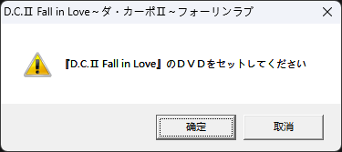
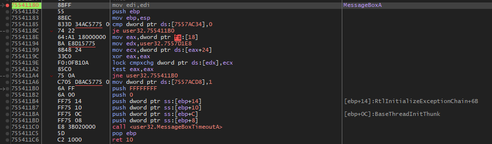
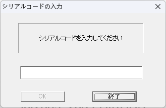
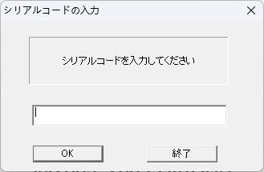
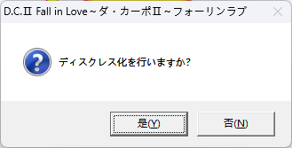
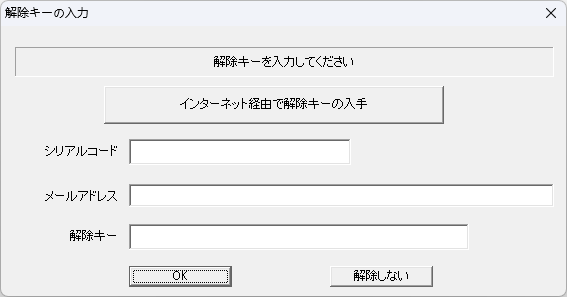
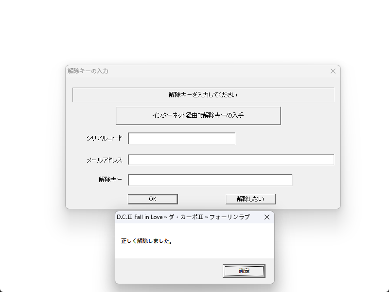

# DC2FL运行补丁思路记录

## 先运行看看


先是个dvd验证  
其实DC系列前三部与其衍生作都基本是一个思路，我暂时弄的几个都是一样的  
DVD验证->序列号验证->key验证(DC1没有)

##  1.DVD验证直接放x32dbg干掉先吧
其实他们都没有壳，直接断个MessageBox就行了  
  
堆栈：
```asm
001AFEA0  00415F96  返回到 dc2fl.00415F96 自 ???
001AFEA4  00000000  
001AFEA8  00451250  dc2fl."『D.C.Ⅱ Fall in Love』のＤＶＤをセットしてください"
001AFEAC  00450D9C  dc2fl."D.C.Ⅱ Fall in Love～ダ・カーポⅡ～フォーリンラブ"
001AFEB0  00000031  
001AFEB4  00400000  dc2fl.00400000
001AFEB8  0102C0D9  
001AFEBC  0040BEAE  返回到 dc2fl.0040BEAE 自 dc2fl.00415F20
001AFEC0  00000000  
```
直接来到上一层调用，其实就是对应的dvd验证函数  
<details>
<summary>dvd验证函数</summary>  

```asm
00415F20 | 833D B047A700 00   | cmp dword ptr ds:[A747B0],0                                        |
00415F27 | 74 1C              | je dc2fl.415F45                                                    |
00415F29 | 68 803EA700        | push dc2fl.A73E80                                                  |
00415F2E | 68 883FA700        | push dc2fl.A73F88                                                  |
00415F33 | 68 9C000000        | push 9C                                                            |
00415F38 | E8 E3FA0000        | call dc2fl.425A20                                                  |
00415F3D | 83C4 0C            | add esp,C                                                          |
00415F40 | 83F8 01            | cmp eax,1                                                          |
00415F43 | 74 30              | je dc2fl.415F75                                                    |
00415F45 | 68 88124500        | push dc2fl.451288                                                  | 451288:"DC2FL"
00415F4A | E8 31FEFFFF        | call dc2fl.415D80                                                  |
00415F4F | 83C4 04            | add esp,4                                                          |
00415F52 | 84C0               | test al,al                                                         |
00415F54 | 74 25              | je dc2fl.415F7B                                                    | 过dvd
00415F56 | 66:8B0D 84124500   | mov cx,word ptr ds:[451284]                                        | 00451284:"Q:"
00415F5D | 8A15 86124500      | mov dl,byte ptr ds:[451286]                                        |
00415F63 | 66:890D 902FA400   | mov word ptr ds:[A42F90],cx                                        |
00415F6A | 8815 922FA400      | mov byte ptr ds:[A42F92],dl                                        |
00415F70 | A2 902FA400        | mov byte ptr ds:[A42F90],al                                        |
00415F75 | B8 01000000        | mov eax,1                                                          |
00415F7A | C3                 | ret                                                                |
00415F7B | 56                 | push esi                                                           |
00415F7C | 8B7424 08          | mov esi,dword ptr ss:[esp+8]                                       | [esp+08]:"『D.C.Ⅱ Fall in Love』のＤＶＤをセットしてください"
00415F80 | 57                 | push edi                                                           | edi:MessageBoxA
00415F81 | 8B3D 24024500      | mov edi,dword ptr ds:[<MessageBoxA>]                               | edi:MessageBoxA
00415F87 | 6A 31              | push 31                                                            |
00415F89 | 68 9C0D4500        | push dc2fl.450D9C                                                  | 450D9C:"D.C.Ⅱ Fall in Love～ダ・カーポⅡ～フォーリンラブ"
00415F8E | 68 50124500        | push dc2fl.451250                                                  | 451250:"『D.C.Ⅱ Fall in Love』のＤＶＤをセットしてください"
00415F93 | 56                 | push esi                                                           |
00415F94 | FFD7               | call edi                                                           | edi:MessageBoxA
00415F96 | 83F8 01            | cmp eax,1                                                          |
00415F99 | 75 2A              | jne dc2fl.415FC5                                                   |
00415F9B | EB 03              | jmp dc2fl.415FA0                                                   |
00415F9D | 8D49 00            | lea ecx,dword ptr ds:[ecx]                                         |
00415FA0 | 68 88124500        | push dc2fl.451288                                                  | 451288:"DC2FL"
00415FA5 | E8 D6FDFFFF        | call dc2fl.415D80                                                  |
00415FAA | 83C4 04            | add esp,4                                                          |
00415FAD | 84C0               | test al,al                                                         |
00415FAF | 75 19              | jne dc2fl.415FCA                                                   |
00415FB1 | 6A 31              | push 31                                                            |
00415FB3 | 68 9C0D4500        | push dc2fl.450D9C                                                  | 450D9C:"D.C.Ⅱ Fall in Love～ダ・カーポⅡ～フォーリンラブ"
00415FB8 | 68 50124500        | push dc2fl.451250                                                  | 451250:"『D.C.Ⅱ Fall in Love』のＤＶＤをセットしてください"
00415FBD | 56                 | push esi                                                           |
00415FBE | FFD7               | call edi                                                           | edi:MessageBoxA
00415FC0 | 83F8 01            | cmp eax,1                                                          |
00415FC3 | 74 DB              | je dc2fl.415FA0                                                    |
00415FC5 | 5F                 | pop edi                                                            | edi:MessageBoxA
00415FC6 | 33C0               | xor eax,eax                                                        |
00415FC8 | 5E                 | pop esi                                                            |
00415FC9 | C3                 | ret                                                                |
00415FCA | 66:8B0D 84124500   | mov cx,word ptr ds:[451284]                                        | 00451284:"Q:"
00415FD1 | 8A15 86124500      | mov dl,byte ptr ds:[451286]                                        |
00415FD7 | 66:890D 902FA400   | mov word ptr ds:[A42F90],cx                                        |
00415FDE | 5F                 | pop edi                                                            | edi:MessageBoxA
00415FDF | A2 902FA400        | mov byte ptr ds:[A42F90],al                                        |
00415FE4 | 8815 922FA400      | mov byte ptr ds:[A42F92],dl                                        |
00415FEA | B8 01000000        | mov eax,1                                                          |
00415FEF | 5E                 | pop esi                                                            |
00415FF0 | C3                 | ret                                                                |
```
</details>  

直接把  
```asm
00415F54 | 74 25              | je dc2fl.415F7B                                                    | 过dvd
```

nop掉即可过dvd  
### 运行看看
  
很好来到序列号验证了  

## 2.过序列号验证
我们可以观察到它的ok是灰色的，正常来说可以点击时应该就证明序列号可能时正确的，寻找正确的返回条件可以作为线索  
我们这里直接断个SendMessageA 
看看堆栈： 
```asm
001AF100  00409CCF  返回到 dc2fl.00409CCF 自 ???
001AF104  001D1A7A  
001AF108  0000000D  
001AF10C  00000104  
001AF110  00A746A8  dc2fl.00A746A8
001AF114  00409C80  dc2fl.00409C80
001AF118  00409C80  dc2fl.00409C80
001AF11C  754E97B3  返回到 user32.Ordinal#2713+833 自 ???
```

跳到返回地址 00409CCF

<details>
<summary>sub_409CCF</summary>  

```asm
00409C80 | 8B4424 08          | mov eax,dword ptr ss:[esp+8]                                       |
00409C84 | 2D 10010000        | sub eax,110                                                        |
00409C89 | 56                 | push esi                                                           |
00409C8A | 57                 | push edi                                                           | edi:GetDlgItem
00409C8B | 0F84 94000000      | je dc2fl.409D25                                                    |
00409C91 | 83E8 01            | sub eax,1                                                          |
00409C94 | 75 72              | jne dc2fl.409D08                                                   |
00409C96 | 8B4424 14          | mov eax,dword ptr ss:[esp+14]                                      |
00409C9A | 83F8 01            | cmp eax,1                                                          |
00409C9D | 74 70              | je dc2fl.409D0F                                                    |
00409C9F | 83F8 02            | cmp eax,2                                                          |
00409CA2 | 74 6B              | je dc2fl.409D0F                                                    |
00409CA4 | B9 E8030000        | mov ecx,3E8                                                        |
00409CA9 | 66:3BC1            | cmp ax,cx                                                          |
00409CAC | 75 5A              | jne dc2fl.409D08                                                   |
00409CAE | 8B7424 0C          | mov esi,dword ptr ss:[esp+C]                                       |
00409CB2 | 8B3D F4024500      | mov edi,dword ptr ds:[<GetDlgItem>]                                | edi:GetDlgItem
00409CB8 | 68 A846A700        | push dc2fl.A746A8                                                  |
00409CBD | 68 04010000        | push 104                                                           |
00409CC2 | 6A 0D              | push D                                                             |
00409CC4 | 51                 | push ecx                                                           |
00409CC5 | 56                 | push esi                                                           |
00409CC6 | FFD7               | call edi                                                           | edi:GetDlgItem
00409CC8 | 50                 | push eax                                                           |
00409CC9 | FF15 F8024500      | call dword ptr ds:[<SendMessageA>]                                 |
00409CCF | 68 9C000000        | push 9C                                                            |
00409CD4 | 68 A846A700        | push dc2fl.A746A8                                                  |
00409CD9 | E8 F2BB0100        | call dc2fl.4258D0                                                  | 检验序列号函数(直接hook它可以防止后面方便过后面key验证)
00409CDE | 83C4 08            | add esp,8                                                          |
00409CE1 | 85C0               | test eax,eax                                                       |
00409CE3 | 7C 15              | jl dc2fl.409CFA                                                    |
00409CE5 | 6A 01              | push 1                                                             | 启用OK建（证明这是正确的返回）
00409CE7 | 6A 01              | push 1                                                             |
00409CE9 | 56                 | push esi                                                           |
00409CEA | FFD7               | call edi                                                           | edi:GetDlgItem
00409CEC | 50                 | push eax                                                           |
00409CED | FF15 E8024500      | call dword ptr ds:[<EnableWindow>]                                 |
00409CF3 | 5F                 | pop edi                                                            | edi:GetDlgItem
00409CF4 | 33C0               | xor eax,eax                                                        |
00409CF6 | 5E                 | pop esi                                                            |
00409CF7 | C2 1000            | ret 10                                                             |
00409CFA | 6A 00              | push 0                                                             |
00409CFC | 6A 01              | push 1                                                             |
00409CFE | 56                 | push esi                                                           |
00409CFF | FFD7               | call edi                                                           | edi:GetDlgItem
00409D01 | 50                 | push eax                                                           |
00409D02 | FF15 E8024500      | call dword ptr ds:[<EnableWindow>]                                 |
00409D08 | 5F                 | pop edi                                                            | edi:GetDlgItem
00409D09 | 33C0               | xor eax,eax                                                        |
00409D0B | 5E                 | pop esi                                                            |
00409D0C | C2 1000            | ret 10                                                             |
00409D0F | 8B5424 0C          | mov edx,dword ptr ss:[esp+C]                                       |
00409D13 | 50                 | push eax                                                           |
00409D14 | 52                 | push edx                                                           |
00409D15 | FF15 F0024500      | call dword ptr ds:[<EndDialog>]                                    |
00409D1B | 5F                 | pop edi                                                            | edi:GetDlgItem
00409D1C | B8 01000000        | mov eax,1                                                          |
00409D21 | 5E                 | pop esi                                                            |
00409D22 | C2 1000            | ret 10                                                             |
00409D25 | 8B7424 0C          | mov esi,dword ptr ss:[esp+C]                                       |
00409D29 | 8B3D F4024500      | mov edi,dword ptr ds:[<GetDlgItem>]                                | edi:GetDlgItem
00409D2F | 6A 00              | push 0                                                             |
00409D31 | 6A 01              | push 1                                                             |
00409D33 | 56                 | push esi                                                           |
00409D34 | FFD7               | call edi                                                           | edi:GetDlgItem
00409D36 | 50                 | push eax                                                           |
00409D37 | FF15 E8024500      | call dword ptr ds:[<EnableWindow>]                                 |
00409D3D | 68 8C074500        | push dc2fl.45078C                                                  |
00409D42 | 68 04010000        | push 104                                                           |
00409D47 | 6A 0C              | push C                                                             |
00409D49 | 68 E8030000        | push 3E8                                                           |
00409D4E | 56                 | push esi                                                           |
00409D4F | FFD7               | call edi                                                           | edi:GetDlgItem
00409D51 | 50                 | push eax                                                           |
00409D52 | FF15 F8024500      | call dword ptr ds:[<SendMessageA>]                                 |
00409D58 | 56                 | push esi                                                           |
00409D59 | E8 62FCFFFF        | call dc2fl.4099C0                                                  |
00409D5E | 83C4 04            | add esp,4                                                          |
00409D61 | 5F                 | pop edi                                                            | edi:GetDlgItem
00409D62 | B8 01000000        | mov eax,1                                                          |
00409D67 | 5E                 | pop esi                                                            |
00409D68 | C2 1000            | ret 10                                                             |
```

</details>  

这里其实可以直接那关键跳给nop掉，即可过序列号验证  
但是仔细一看，其实只要 call dc2fl.4258D0 的返回时eax是0即可  
所以我就直接把该函数给改了  

<details>
<summary>sub_4258D0</summary>  

```asm
004258D0 | 83EC 18            | sub esp,18                                                         |
004258D3 | A1 50545400        | mov eax,dword ptr ds:[545450]                                      |
004258D8 | 33C4               | xor eax,esp                                                        |
004258DA | 894424 14          | mov dword ptr ss:[esp+14],eax                                      |
004258DE | 57                 | push edi                                                           | edi:GetDlgItem
004258DF | 8B7C24 20          | mov edi,dword ptr ss:[esp+20]                                      | edi:GetDlgItem
004258E3 | 8BC7               | mov eax,edi                                                        | edi:GetDlgItem
004258E5 | 8D50 01            | lea edx,dword ptr ds:[eax+1]                                       |
004258E8 | 8A08               | mov cl,byte ptr ds:[eax]                                           |
004258EA | 40                 | inc eax                                                            |
004258EB | 84C9               | test cl,cl                                                         |
004258ED | 75 F9              | jne dc2fl.4258E8                                                   |
004258EF | 2BC2               | sub eax,edx                                                        |
004258F1 | 83F8 0B            | cmp eax,B                                                          | 0B:'\v'
004258F4 | 74 15              | je dc2fl.42590B                                                    |
004258F6 | B8 FCFFFFFF        | mov eax,FFFFFFFC                                                   |
004258FB | 5F                 | pop edi                                                            | edi:GetDlgItem
004258FC | 8B4C24 14          | mov ecx,dword ptr ss:[esp+14]                                      |
00425900 | 33CC               | xor ecx,esp                                                        |
00425902 | E8 EF680000        | call dc2fl.42C1F6                                                  |
00425907 | 83C4 18            | add esp,18                                                         |
0042590A | C3                 | ret                                                                |
0042590B | 8A07               | mov al,byte ptr ds:[edi]                                           | edi:GetDlgItem
0042590D | 56                 | push esi                                                           |
0042590E | 8D7424 08          | lea esi,dword ptr ss:[esp+8]                                       |
00425912 | 84C0               | test al,al                                                         |
00425914 | 74 16              | je dc2fl.42592C                                                    |
00425916 | 0FBEC0             | movsx eax,al                                                       |
00425919 | 50                 | push eax                                                           |
0042591A | E8 AB680000        | call dc2fl.42C1CA                                                  |
0042591F | 47                 | inc edi                                                            | edi:GetDlgItem
00425920 | 8806               | mov byte ptr ds:[esi],al                                           |
00425922 | 8A07               | mov al,byte ptr ds:[edi]                                           | edi:GetDlgItem
00425924 | 83C4 04            | add esp,4                                                          |
00425927 | 46                 | inc esi                                                            |
00425928 | 84C0               | test al,al                                                         |
0042592A | 75 EA              | jne dc2fl.425916                                                   |
0042592C | 8D4C24 08          | lea ecx,dword ptr ss:[esp+8]                                       |
00425930 | 53                 | push ebx                                                           |
00425931 | 51                 | push ecx                                                           |
00425932 | C606 00            | mov byte ptr ds:[esi],0                                            |
00425935 | E8 36FFFFFF        | call dc2fl.425870                                                  |
0042593A | 8D5424 10          | lea edx,dword ptr ss:[esp+10]                                      |
0042593E | 6A 02              | push 2                                                             |
00425940 | 52                 | push edx                                                           |
00425941 | E8 DAFEFFFF        | call dc2fl.425820                                                  |
00425946 | 8BD8               | mov ebx,eax                                                        |
00425948 | 8D4424 1A          | lea eax,dword ptr ss:[esp+1A]                                      |
0042594C | 6A 05              | push 5                                                             |
0042594E | 50                 | push eax                                                           |
0042594F | E8 CCFEFFFF        | call dc2fl.425820                                                  |
00425954 | 8D4C24 27          | lea ecx,dword ptr ss:[esp+27]                                      |
00425958 | 6A 04              | push 4                                                             |
0042595A | 51                 | push ecx                                                           |
0042595B | 8BF0               | mov esi,eax                                                        |
0042595D | E8 BEFEFFFF        | call dc2fl.425820                                                  |
00425962 | 8D5424 28          | lea edx,dword ptr ss:[esp+28]                                      |
00425966 | 6A 07              | push 7                                                             |
00425968 | 52                 | push edx                                                           |
00425969 | 8BF8               | mov edi,eax                                                        | edi:GetDlgItem
0042596B | E8 C0FDFFFF        | call dc2fl.425730                                                  |
00425970 | 0FB7C8             | movzx ecx,ax                                                       |
00425973 | B8 1F85EB51        | mov eax,51EB851F                                                   |
00425978 | F7E9               | imul ecx                                                           |
0042597A | C1FA 03            | sar edx,3                                                          |
0042597D | 8BC2               | mov eax,edx                                                        |
0042597F | C1E8 1F            | shr eax,1F                                                         |
00425982 | 03C2               | add eax,edx                                                        |
00425984 | 8BD1               | mov edx,ecx                                                        |
00425986 | 2BD0               | sub edx,eax                                                        |
00425988 | 6BD2 19            | imul edx,edx,19                                                    |
0042598B | 03D1               | add edx,ecx                                                        |
0042598D | 83C4 24            | add esp,24                                                         |
00425990 | 3BD7               | cmp edx,edi                                                        | edi:GetDlgItem
00425992 | 74 15              | je dc2fl.4259A9                                                    |
00425994 | 5B                 | pop ebx                                                            |
00425995 | 5E                 | pop esi                                                            |
00425996 | 83C8 FF            | or eax,FFFFFFFF                                                    |
00425999 | 5F                 | pop edi                                                            | edi:GetDlgItem
0042599A | 8B4C24 14          | mov ecx,dword ptr ss:[esp+14]                                      |
0042599E | 33CC               | xor ecx,esp                                                        |
004259A0 | E8 51680000        | call dc2fl.42C1F6                                                  |
004259A5 | 83C4 18            | add esp,18                                                         |
004259A8 | C3                 | ret                                                                |
004259A9 | B8 6BCA5F6B        | mov eax,6B5FCA6B                                                   |
004259AE | F7EE               | imul esi                                                           |
004259B0 | C1FA 16            | sar edx,16                                                         |
004259B3 | 8BC2               | mov eax,edx                                                        |
004259B5 | C1E8 1F            | shr eax,1F                                                         |
004259B8 | 03C2               | add eax,edx                                                        |
004259BA | 69C0 80969800      | imul eax,eax,dc2fl.989680                                          |
004259C0 | 8BCE               | mov ecx,esi                                                        |
004259C2 | 2BC8               | sub ecx,eax                                                        |
004259C4 | B8 ABAAAA2A        | mov eax,2AAAAAAB                                                   |
004259C9 | F7E9               | imul ecx                                                           |
004259CB | 8BC2               | mov eax,edx                                                        |
004259CD | C1E8 1F            | shr eax,1F                                                         |
004259D0 | 03C2               | add eax,edx                                                        |
004259D2 | 8BD1               | mov edx,ecx                                                        |
004259D4 | 69C0 00879303      | imul eax,eax,3938700                                               |
004259DA | 69D2 81969800      | imul edx,edx,dc2fl.989681                                          |
004259E0 | 2BD0               | sub edx,eax                                                        |
004259E2 | 3BD6               | cmp edx,esi                                                        |
004259E4 | 74 17              | je dc2fl.4259FD                                                    |
004259E6 | 5B                 | pop ebx                                                            |
004259E7 | 5E                 | pop esi                                                            |
004259E8 | B8 FEFFFFFF        | mov eax,FFFFFFFE                                                   |
004259ED | 5F                 | pop edi                                                            | edi:GetDlgItem
004259EE | 8B4C24 14          | mov ecx,dword ptr ss:[esp+14]                                      |
004259F2 | 33CC               | xor ecx,esp                                                        |
004259F4 | E8 FD670000        | call dc2fl.42C1F6                                                  |
004259F9 | 83C4 18            | add esp,18                                                         |
004259FC | C3                 | ret                                                                |
004259FD | B8 FDFFFFFF        | mov eax,FFFFFFFD                                                   |
00425A02 | 3B5C24 2C          | cmp ebx,dword ptr ss:[esp+2C]                                      |
00425A06 | 75 02              | jne dc2fl.425A0A                                                   |
00425A08 | 8BC1               | mov eax,ecx                                                        |
00425A0A | 8B4C24 20          | mov ecx,dword ptr ss:[esp+20]                                      |
00425A0E | 5B                 | pop ebx                                                            |
00425A0F | 5E                 | pop esi                                                            |
00425A10 | 5F                 | pop edi                                                            | edi:GetDlgItem
00425A11 | 33CC               | xor ecx,esp                                                        |
00425A13 | E8 DE670000        | call dc2fl.42C1F6                                                  |
00425A18 | 83C4 18            | add esp,18                                                         |
00425A1B | C3                 | ret                                                                |
```

</details>  

直接把开头改成  
```
004258D0 | B8 00000000        | mov eax,0                                                          |
004258D5 | C3                 | ret                                                                |
```

### 运行看看
    
ok按钮可以点击了，我们点击一下  
    
这里会问我们是否设置免光盘运行  
  
我们点击是，进入key验证  

## 3.过KEY验证（我弄第一部时似乎没有这个，但dc3也有的，思路一样）  
我们依然可以通过断SendMessageA->点击一下输入框->从堆栈找到key验证函数

<details>
<summary>sub_4258D0</summary> 

```asm
00409D70 | 8B4424 08          | mov eax,dword ptr ss:[esp+8]                                       |
00409D74 | 2D 10010000        | sub eax,110                                                        |
00409D79 | 53                 | push ebx                                                           |
00409D7A | 56                 | push esi                                                           |
00409D7B | 57                 | push edi                                                           |
00409D7C | 0F84 C6010000      | je dc2fl.409F48                                                    |
00409D82 | 83E8 01            | sub eax,1                                                          |
00409D85 | 0F85 B5010000      | jne dc2fl.409F40                                                   |
00409D8B | 8B4424 18          | mov eax,dword ptr ss:[esp+18]                                      |
00409D8F | 83F8 01            | cmp eax,1                                                          |
00409D92 | 0F85 B1000000      | jne dc2fl.409E49                                                   |
00409D98 | 8B7424 10          | mov esi,dword ptr ss:[esp+10]                                      |
00409D9C | 8B3D F4024500      | mov edi,dword ptr ds:[<GetDlgItem>]                                |
00409DA2 | 68 803EA700        | push dc2fl.A73E80                                                  |
00409DA7 | 68 04010000        | push 104                                                           |
00409DAC | 6A 0D              | push D                                                             |
00409DAE | 68 E9030000        | push 3E9                                                           |
00409DB3 | 56                 | push esi                                                           |
00409DB4 | FFD7               | call edi                                                           |
00409DB6 | 8B1D F8024500      | mov ebx,dword ptr ds:[<SendMessageA>]                              |
00409DBC | 50                 | push eax                                                           |
00409DBD | FFD3               | call ebx                                                           |
00409DBF | 68 883FA700        | push dc2fl.A73F88                                                  |
00409DC4 | 68 04010000        | push 104                                                           |
00409DC9 | 6A 0D              | push D                                                             |
00409DCB | 68 F4030000        | push 3F4                                                           |
00409DD0 | 56                 | push esi                                                           |
00409DD1 | FFD7               | call edi                                                           |
00409DD3 | 50                 | push eax                                                           |
00409DD4 | FFD3               | call ebx                                                           |
00409DD6 | 68 9C000000        | push 9C                                                            |
00409DDB | 68 A846A700        | push dc2fl.A746A8                                                  |
00409DE0 | E8 EBBA0100        | call <dc2fl.sub_4258D0>                                            |
00409DE5 | 83C4 08            | add esp,8                                                          |
00409DE8 | 85C0               | test eax,eax                                                       |
00409DEA | 7C 42              | jl dc2fl.409E2E                                                    |
00409DEC | 68 803EA700        | push dc2fl.A73E80                                                  |
00409DF1 | 68 883FA700        | push dc2fl.A73F88                                                  |
00409DF6 | 68 9C000000        | push 9C                                                            |
00409DFB | E8 20BC0100        | call dc2fl.425A20                                                  | key验证函数（直接hook它）
00409E00 | 83C4 0C            | add esp,C                                                          |
00409E03 | 85C0               | test eax,eax                                                       |
00409E05 | 74 27              | je dc2fl.409E2E                                                    |
00409E07 | 6A 00              | push 0                                                             |
00409E09 | 68 9C0D4500        | push dc2fl.450D9C                                                  | 450D9C:"D.C.Ⅱ Fall in Love～ダ・カーポⅡ～フォーリンラブ"
00409E0E | 68 300F4500        | push dc2fl.450F30                                                  | 450F30:"正しく解除しました。"
00409E13 | 56                 | push esi                                                           |
00409E14 | FF15 24024500      | call dword ptr ds:[<MessageBoxA>]                                  |
00409E1A | 6A 01              | push 1                                                             |
00409E1C | 56                 | push esi                                                           |
00409E1D | FF15 F0024500      | call dword ptr ds:[<EndDialog>]                                    |
00409E23 | 5F                 | pop edi                                                            |
00409E24 | 5E                 | pop esi                                                            |
00409E25 | B8 01000000        | mov eax,1                                                          |
00409E2A | 5B                 | pop ebx                                                            |
00409E2B | C2 1000            | ret 10                                                             |
00409E2E | 6A 00              | push 0                                                             |
00409E30 | 68 9C0D4500        | push dc2fl.450D9C                                                  | 450D9C:"D.C.Ⅱ Fall in Love～ダ・カーポⅡ～フォーリンラブ"
00409E35 | 68 A80E4500        | push dc2fl.450EA8                                                  | 450EA8:"解除情報が正しくありません。\nメールアドレスと解除キーを確認してください。\n解除キーはインターネット経由で入手したものを入れてください。"
00409E3A | 56                 | push esi                                                           |
00409E3B | FF15 24024500      | call dword ptr ds:[<MessageBoxA>]                                  |
00409E41 | 5F                 | pop edi                                                            |
00409E42 | 5E                 | pop esi                                                            |
00409E43 | 33C0               | xor eax,eax                                                        |
00409E45 | 5B                 | pop ebx                                                            |
00409E46 | C2 1000            | ret 10                                                             |
00409E49 | 83F8 02            | cmp eax,2                                                          |
00409E4C | 75 34              | jne dc2fl.409E82                                                   |
00409E4E | 8B7424 10          | mov esi,dword ptr ss:[esp+10]                                      |
00409E52 | 6A 01              | push 1                                                             |
00409E54 | 68 9C0D4500        | push dc2fl.450D9C                                                  | 450D9C:"D.C.Ⅱ Fall in Love～ダ・カーポⅡ～フォーリンラブ"
00409E59 | 68 740E4500        | push dc2fl.450E74                                                  | 450E74:"解除しないとディスクレスでプレイできません。"
00409E5E | 56                 | push esi                                                           |
00409E5F | FF15 24024500      | call dword ptr ds:[<MessageBoxA>]                                  |
00409E65 | 83F8 01            | cmp eax,1                                                          |
00409E68 | 0F85 D2000000      | jne dc2fl.409F40                                                   |
00409E6E | 6A 02              | push 2                                                             |
00409E70 | 56                 | push esi                                                           |
00409E71 | FF15 F0024500      | call dword ptr ds:[<EndDialog>]                                    |
00409E77 | 5F                 | pop edi                                                            |
00409E78 | 5E                 | pop esi                                                            |
00409E79 | B8 01000000        | mov eax,1                                                          |
00409E7E | 5B                 | pop ebx                                                            |
00409E7F | C2 1000            | ret 10                                                             |
00409E82 | 3D F5030000        | cmp eax,3F5                                                        |
00409E87 | 75 52              | jne dc2fl.409EDB                                                   |
00409E89 | 8B7424 10          | mov esi,dword ptr ss:[esp+10]                                      |
00409E8D | 8B3D 24024500      | mov edi,dword ptr ds:[<MessageBoxA>]                               |
00409E93 | 6A 01              | push 1                                                             |
00409E95 | 68 9C0D4500        | push dc2fl.450D9C                                                  | 450D9C:"D.C.Ⅱ Fall in Love～ダ・カーポⅡ～フォーリンラブ"
00409E9A | 68 380E4500        | push dc2fl.450E38                                                  | 450E38:"http://circus03.nandemo.gr.jp/getkey/circus/\nに接続します。"
00409E9F | 56                 | push esi                                                           |
00409EA0 | FFD7               | call edi                                                           |
00409EA2 | 83F8 01            | cmp eax,1                                                          |
00409EA5 | 0F85 95000000      | jne dc2fl.409F40                                                   |
00409EAB | 6A 00              | push 0                                                             |
00409EAD | 68 080E4500        | push dc2fl.450E08                                                  | 450E08:"http://circus03.nandemo.gr.jp/getkey/circus/"
00409EB2 | 68 000E4500        | push dc2fl.450E00                                                  | 450E00:".html"
00409EB7 | 56                 | push esi                                                           |
00409EB8 | E8 B3C80000        | call dc2fl.416770                                                  |
00409EBD | 83C4 10            | add esp,10                                                         |
00409EC0 | 85C0               | test eax,eax                                                       |
00409EC2 | 74 7C              | je dc2fl.409F40                                                    |
00409EC4 | 6A 00              | push 0                                                             |
00409EC6 | 68 9C0D4500        | push dc2fl.450D9C                                                  | 450D9C:"D.C.Ⅱ Fall in Love～ダ・カーポⅡ～フォーリンラブ"
00409ECB | 68 D80D4500        | push dc2fl.450DD8                                                  | 450DD8:"ウェブブラウザを起動できませんでした。"
00409ED0 | 56                 | push esi                                                           |
00409ED1 | FFD7               | call edi                                                           |
00409ED3 | 5F                 | pop edi                                                            |
00409ED4 | 5E                 | pop esi                                                            |
00409ED5 | 33C0               | xor eax,eax                                                        |
00409ED7 | 5B                 | pop ebx                                                            |
00409ED8 | C2 1000            | ret 10                                                             |
00409EDB | B9 E8030000        | mov ecx,3E8                                                        |
00409EE0 | 66:3BC1            | cmp ax,cx                                                          |
00409EE3 | 75 5B              | jne dc2fl.409F40                                                   |
00409EE5 | 8B7424 10          | mov esi,dword ptr ss:[esp+10]                                      |
00409EE9 | 8B3D F4024500      | mov edi,dword ptr ds:[<GetDlgItem>]                                |
00409EEF | 68 A846A700        | push dc2fl.A746A8                                                  |
00409EF4 | 68 04010000        | push 104                                                           |
00409EF9 | 6A 0D              | push D                                                             |
00409EFB | 51                 | push ecx                                                           |
00409EFC | 56                 | push esi                                                           |
00409EFD | FFD7               | call edi                                                           |
00409EFF | 50                 | push eax                                                           |
00409F00 | FF15 F8024500      | call dword ptr ds:[<SendMessageA>]                                 |
00409F06 | 68 9C000000        | push 9C                                                            |
00409F0B | 68 A846A700        | push dc2fl.A746A8                                                  |
00409F10 | E8 BBB90100        | call <dc2fl.sub_4258D0>                                            |
00409F15 | 83C4 08            | add esp,8                                                          |
00409F18 | 85C0               | test eax,eax                                                       |
00409F1A | 7C 16              | jl dc2fl.409F32                                                    |
00409F1C | 6A 01              | push 1                                                             |
00409F1E | 6A 01              | push 1                                                             |
00409F20 | 56                 | push esi                                                           |
00409F21 | FFD7               | call edi                                                           |
00409F23 | 50                 | push eax                                                           |
00409F24 | FF15 E8024500      | call dword ptr ds:[<EnableWindow>]                                 |
00409F2A | 5F                 | pop edi                                                            |
00409F2B | 5E                 | pop esi                                                            |
00409F2C | 33C0               | xor eax,eax                                                        |
00409F2E | 5B                 | pop ebx                                                            |
00409F2F | C2 1000            | ret 10                                                             |
00409F32 | 6A 00              | push 0                                                             |
00409F34 | 6A 01              | push 1                                                             |
00409F36 | 56                 | push esi                                                           |
00409F37 | FFD7               | call edi                                                           |
00409F39 | 50                 | push eax                                                           |
00409F3A | FF15 E8024500      | call dword ptr ds:[<EnableWindow>]                                 |
00409F40 | 5F                 | pop edi                                                            |
00409F41 | 5E                 | pop esi                                                            |
00409F42 | 33C0               | xor eax,eax                                                        |
00409F44 | 5B                 | pop ebx                                                            |
00409F45 | C2 1000            | ret 10                                                             |
00409F48 | 68 9C000000        | push 9C                                                            |
00409F4D | 68 A846A700        | push dc2fl.A746A8                                                  |
00409F52 | E8 79B90100        | call <dc2fl.sub_4258D0>                                            |
00409F57 | 8B7424 18          | mov esi,dword ptr ss:[esp+18]                                      |
00409F5B | 8B3D F4024500      | mov edi,dword ptr ds:[<GetDlgItem>]                                |
00409F61 | 83C4 08            | add esp,8                                                          |
00409F64 | 85C0               | test eax,eax                                                       |
00409F66 | 7C 07              | jl dc2fl.409F6F                                                    |
00409F68 | 68 A846A700        | push dc2fl.A746A8                                                  |
00409F6D | EB 05              | jmp dc2fl.409F74                                                   |
00409F6F | 68 8C074500        | push dc2fl.45078C                                                  |
00409F74 | 68 04010000        | push 104                                                           |
00409F79 | 6A 0C              | push C                                                             |
00409F7B | 68 E8030000        | push 3E8                                                           |
00409F80 | 56                 | push esi                                                           |
00409F81 | FFD7               | call edi                                                           |
00409F83 | 8B1D F8024500      | mov ebx,dword ptr ds:[<SendMessageA>]                              |
00409F89 | 50                 | push eax                                                           |
00409F8A | FFD3               | call ebx                                                           |
00409F8C | 68 8C074500        | push dc2fl.45078C                                                  |
00409F91 | 68 04010000        | push 104                                                           |
00409F96 | 6A 0C              | push C                                                             |
00409F98 | 68 F4030000        | push 3F4                                                           |
00409F9D | 56                 | push esi                                                           |
00409F9E | FFD7               | call edi                                                           |
00409FA0 | 50                 | push eax                                                           |
00409FA1 | FFD3               | call ebx                                                           |
00409FA3 | 68 8C074500        | push dc2fl.45078C                                                  |
00409FA8 | 68 04010000        | push 104                                                           |
00409FAD | 6A 0C              | push C                                                             |
00409FAF | 68 E9030000        | push 3E9                                                           |
00409FB4 | 56                 | push esi                                                           |
00409FB5 | FFD7               | call edi                                                           |
00409FB7 | 50                 | push eax                                                           |
00409FB8 | FFD3               | call ebx                                                           |
00409FBA | 56                 | push esi                                                           |
00409FBB | E8 00FAFFFF        | call dc2fl.4099C0                                                  |
00409FC0 | 56                 | push esi                                                           |
00409FC1 | E8 7AFAFFFF        | call dc2fl.409A40                                                  |
00409FC6 | 83C4 08            | add esp,8                                                          |
00409FC9 | 5F                 | pop edi                                                            |
00409FCA | 5E                 | pop esi                                                            |
00409FCB | B8 01000000        | mov eax,1                                                          |
00409FD0 | 5B                 | pop ebx                                                            |
00409FD1 | C2 1000            | ret 10                                                             |
```

</details>  

逻辑也是差不多，我们也是直接把call 0x00425A20的入口改掉

改成
```asm
00425A20 | B8 01000000        | mov eax,1                                                          |
00425A25 | C3                 | ret                                                                |
```

### 运行看看



## 很好完成了，可以直接补丁了


