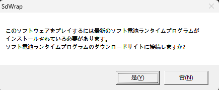
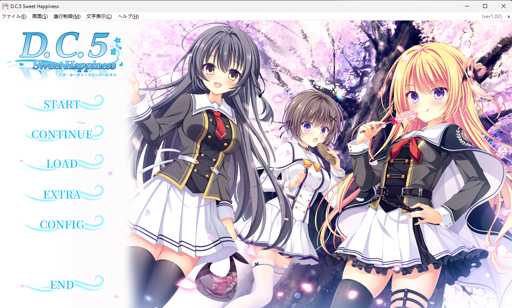

# DC5SH运行补丁记录
## 随便看看
  
不同与前面的dc,这个是软电池，那么顺便查一下壳（没壳）  
那么就直接开始调试
## 过软电池
先断个MessageBoxA看看  
看看堆栈  
```
001AF674  00401784  返回到 dc5sh.00401784 自 ???
001AF678  00000000  
001AF67C  00412C88  dc5sh."このソフトウェアをプレイするには最新のソフト電池ランタイムプログラムが\nインストールされている必要があります。\nソフト電池ランタイムプログラムのダウンロードサイトに接続しますか?"
001AF680  00409044  dc5sh."SdWrap"
001AF684  00000004  
001AF688  0040175E  返回到 dc5sh.sub_4016F0+6E 自 dc5sh.00401770
001AF68C  00409738  dc5sh."SdW7\rI艫ｰ贐g"
001AF690  00402093  返回到 dc5sh.sub_402080+13 自 dc5sh.sub_4016F0
001AF694  000E1274  
001AF698  00402260  dc5sh.sub_402260
001AF69C  000E1274  
001AF6A0  004022BB  返回到 dc5sh.sub_402260+5B 自 dc5sh.sub_402080
001AF6A4  000E1274  
001AF6A8  00000000  
```
一个个看一下，发现
```
001AF6A0  004022BB  返回到 dc5sh.sub_402260+5B 自 dc5sh.sub_402080
```
<details>
<summary>sub_402260</summary>

```
00402260 | 81EC 4C010000              | sub esp,14C                                                        |
00402266 | 53                         | push ebx                                                           |
00402267 | 8B9C24 58010000            | mov ebx,dword ptr ss:[esp+158]                                     |
0040226E | 55                         | push ebp                                                           |
0040226F | 56                         | push esi                                                           |
00402270 | 81FB 11010000              | cmp ebx,111                                                        |
00402276 | 57                         | push edi                                                           |
00402277 | 0F87 95010000              | ja dc5sh.402412                                                    |
0040227D | 0F84 EE000000              | je dc5sh.402371                                                    |
00402283 | 8D43 FF                    | lea eax,dword ptr ds:[ebx-1]                                       |
00402286 | 83F8 10                    | cmp eax,10                                                         |
00402289 | 0F87 A2010000              | ja dc5sh.402431                                                    |
0040228F | 33C9                       | xor ecx,ecx                                                        |
00402291 | 8A88 84274000              | mov cl,byte ptr ds:[eax+402784]                                    |
00402297 | FF248D 70274000            | jmp dword ptr ds:[ecx*4+402770]                                    |
0040229E | 8B9424 6C010000            | mov edx,dword ptr ss:[esp+16C]                                     |
004022A5 | 8B8424 68010000            | mov eax,dword ptr ss:[esp+168]                                     |
004022AC | 8BB424 60010000            | mov esi,dword ptr ss:[esp+160]                                     | [esp+160]:"themewnd"
004022B3 | 52                         | push edx                                                           |
004022B4 | 50                         | push eax                                                           |
004022B5 | 56                         | push esi                                                           |
004022B6 | E8 C5FDFFFF                | call <dc5sh.sub_402080>                                            | 软电池弹窗
004022BB | 83C4 0C                    | add esp,C                                                          |
004022BE | 84C0                       | test al,al                                                         |
004022C0 | 0F85 9A040000              | jne dc5sh.402760                                                   |
004022C6 | E8 25230000                | call dc5sh.4045F0                                                  |
004022CB | 56                         | push esi                                                           |
004022CC | FF15 A8714000              | call dword ptr ds:[<DestroyWindow>]                                |
004022D2 | 5F                         | pop edi                                                            |
004022D3 | 5E                         | pop esi                                                            |
004022D4 | 5D                         | pop ebp                                                            |
004022D5 | 33C0                       | xor eax,eax                                                        |
004022D7 | 5B                         | pop ebx                                                            |
004022D8 | 81C4 4C010000              | add esp,14C                                                        |
004022DE | C2 1000                    | ret 10                                                             |
004022E1 | 8BB424 60010000            | mov esi,dword ptr ss:[esp+160]                                     | [esp+160]:"themewnd"
004022E8 | 8D4C24 18                  | lea ecx,dword ptr ss:[esp+18]                                      | [esp+18]:"SdW7\rI艫ｰ贐g"
004022EC | 51                         | push ecx                                                           |
004022ED | 56                         | push esi                                                           |
004022EE | FF15 AC714000              | call dword ptr ds:[<BeginPaint>]                                   |
004022F4 | 8D5424 18                  | lea edx,dword ptr ss:[esp+18]                                      | [esp+18]:"SdW7\rI艫ｰ贐g"
004022F8 | 52                         | push edx                                                           |
004022F9 | 56                         | push esi                                                           |
004022FA | FF15 B0714000              | call dword ptr ds:[<EndPaint>]                                     |
00402300 | 5F                         | pop edi                                                            |
00402301 | 5E                         | pop esi                                                            |
00402302 | 5D                         | pop ebp                                                            |
00402303 | 33C0                       | xor eax,eax                                                        |
00402305 | 5B                         | pop ebx                                                            |
00402306 | 81C4 4C010000              | add esp,14C                                                        |
0040230C | C2 1000                    | ret 10                                                             |
0040230F | 8BB424 60010000            | mov esi,dword ptr ss:[esp+160]                                     | [esp+160]:"themewnd"
00402316 | 8B3D B4714000              | mov edi,dword ptr ds:[<KillTimer>]                                 |
0040231C | 68 00040000                | push 400                                                           |
00402321 | 56                         | push esi                                                           |
00402322 | FFD7                       | call edi                                                           |
00402324 | 68 01040000                | push 401                                                           |
00402329 | 56                         | push esi                                                           |
0040232A | FFD7                       | call edi                                                           |
0040232C | 68 02040000                | push 402                                                           |
00402331 | 56                         | push esi                                                           |
00402332 | FFD7                       | call edi                                                           |
00402334 | E8 67290000                | call dc5sh.404CA0                                                  |
00402339 | E8 B2220000                | call dc5sh.4045F0                                                  |
0040233E | E8 5D1B0000                | call dc5sh.403EA0                                                  |
00402343 | 6A 00                      | push 0                                                             |
00402345 | FF15 B8714000              | call dword ptr ds:[<PostQuitMessage>]                              |
0040234B | 5F                         | pop edi                                                            |
0040234C | 5E                         | pop esi                                                            |
0040234D | 5D                         | pop ebp                                                            |
0040234E | 33C0                       | xor eax,eax                                                        |
00402350 | 5B                         | pop ebx                                                            |
00402351 | 81C4 4C010000              | add esp,14C                                                        |
00402357 | C2 1000                    | ret 10                                                             |
0040235A | E8 91220000                | call dc5sh.4045F0                                                  |
0040235F | 5F                         | pop edi                                                            |
00402360 | 5E                         | pop esi                                                            |
00402361 | 5D                         | pop ebp                                                            |
00402362 | B8 01000000                | mov eax,1                                                          |
00402367 | 5B                         | pop ebx                                                            |
00402368 | 81C4 4C010000              | add esp,14C                                                        |
0040236E | C2 1000                    | ret 10                                                             |
00402371 | 8B8C24 68010000            | mov ecx,dword ptr ss:[esp+168]                                     |
00402378 | 8BC1                       | mov eax,ecx                                                        |
0040237A | 25 FFFF0000                | and eax,FFFF                                                       |
0040237F | 3D 03800000                | cmp eax,8003                                                       |
00402384 | 7F 58                      | jg dc5sh.4023DE                                                    |
00402386 | 0F84 D4030000              | je dc5sh.402760                                                    |
0040238C | 83E8 68                    | sub eax,68                                                         |
0040238F | 74 20                      | je dc5sh.4023B1                                                    |
00402391 | 48                         | dec eax                                                            |
00402392 | 75 55                      | jne dc5sh.4023E9                                                   |
00402394 | 8B8424 60010000            | mov eax,dword ptr ss:[esp+160]                                     | [esp+160]:"themewnd"
0040239B | 50                         | push eax                                                           |
0040239C | FF15 A8714000              | call dword ptr ds:[<DestroyWindow>]                                |
004023A2 | 5F                         | pop edi                                                            |
004023A3 | 5E                         | pop esi                                                            |
004023A4 | 5D                         | pop ebp                                                            |
004023A5 | 33C0                       | xor eax,eax                                                        |
004023A7 | 5B                         | pop ebx                                                            |
004023A8 | 81C4 4C010000              | add esp,14C                                                        |
004023AE | C2 1000                    | ret 10                                                             |
004023B1 | 8B8C24 60010000            | mov ecx,dword ptr ss:[esp+160]                                     | [esp+160]:"themewnd"
004023B8 | 8B15 D8394100              | mov edx,dword ptr ds:[4139D8]                                      |
004023BE | 6A 00                      | push 0                                                             |
004023C0 | 68 A0274000                | push dc5sh.4027A0                                                  |
004023C5 | 51                         | push ecx                                                           |
004023C6 | 6A 67                      | push 67                                                            |
004023C8 | 52                         | push edx                                                           |
004023C9 | FF15 BC714000              | call dword ptr ds:[<DialogBoxParamA>]                              |
004023CF | 5F                         | pop edi                                                            |
004023D0 | 5E                         | pop esi                                                            |
004023D1 | 5D                         | pop ebp                                                            |
004023D2 | 33C0                       | xor eax,eax                                                        |
004023D4 | 5B                         | pop ebx                                                            |
004023D5 | 81C4 4C010000              | add esp,14C                                                        |
004023DB | C2 1000                    | ret 10                                                             |
004023DE | 3D 04800000                | cmp eax,8004                                                       |
004023E3 | 0F84 77030000              | je dc5sh.402760                                                    |
004023E9 | 8B8424 6C010000            | mov eax,dword ptr ss:[esp+16C]                                     |
004023F0 | 50                         | push eax                                                           |
004023F1 | 51                         | push ecx                                                           |
004023F2 | 8B8C24 68010000            | mov ecx,dword ptr ss:[esp+168]                                     |
004023F9 | 68 11010000                | push 111                                                           |
004023FE | 51                         | push ecx                                                           |
004023FF | FF15 C0714000              | call dword ptr ds:[<DefWindowProcA>]                               |
00402405 | 5F                         | pop edi                                                            |
00402406 | 5E                         | pop esi                                                            |
00402407 | 5D                         | pop ebp                                                            |
00402408 | 5B                         | pop ebx                                                            |
00402409 | 81C4 4C010000              | add esp,14C                                                        |
0040240F | C2 1000                    | ret 10                                                             |
00402412 | 8BC3                       | mov eax,ebx                                                        |
00402414 | 2D 13010000                | sub eax,113                                                        |
00402419 | 0F84 14020000              | je dc5sh.402633                                                    |
0040241F | 2D 01030000                | sub eax,301                                                        |
00402424 | 0F84 93010000              | je dc5sh.4025BD                                                    |
0040242A | 48                         | dec eax                                                            |
0040242B | 0F84 6F010000              | je dc5sh.4025A0                                                    |
00402431 | A1 0C394100                | mov eax,dword ptr ds:[41390C]                                      |
00402436 | 8BB424 60010000            | mov esi,dword ptr ss:[esp+160]                                     | [esp+160]:"themewnd"
0040243D | 8BAC24 68010000            | mov ebp,dword ptr ss:[esp+168]                                     |
00402444 | 3BC3                       | cmp eax,ebx                                                        |
00402446 | 0F85 36010000              | jne dc5sh.402582                                                   |
0040244C | 8B9424 6C010000            | mov edx,dword ptr ss:[esp+16C]                                     |
00402453 | 52                         | push edx                                                           |
00402454 | 55                         | push ebp                                                           |
00402455 | E8 B6280000                | call dc5sh.404D10                                                  |
0040245A | A0 E0394100                | mov al,byte ptr ds:[4139E0]                                        |
0040245F | 83C4 08                    | add esp,8                                                          |
00402462 | 84C0                       | test al,al                                                         |
00402464 | 0F84 18010000              | je dc5sh.402582                                                    |
0040246A | 83FD 04                    | cmp ebp,4                                                          |
0040246D | 74 09                      | je dc5sh.402478                                                    |
0040246F | 83FD 0D                    | cmp ebp,D                                                          | 0D:'\r'
00402472 | 0F85 0A010000              | jne dc5sh.402582                                                   |
00402478 | E8 43F0FFFF                | call dc5sh.4014C0                                                  |
0040247D | 8BF8                       | mov edi,eax                                                        |
0040247F | F647 4C A4                 | test byte ptr ds:[edi+4C],A4                                       |
00402483 | 0F85 F9000000              | jne dc5sh.402582                                                   |
00402489 | 6A 00                      | push 0                                                             |
0040248B | E8 20F3FFFF                | call dc5sh.4017B0                                                  |
00402490 | 83C4 04                    | add esp,4                                                          |
00402493 | 84C0                       | test al,al                                                         |
00402495 | 74 34                      | je dc5sh.4024CB                                                    |
00402497 | 68 01040000                | push 401                                                           |
0040249C | 56                         | push esi                                                           |
0040249D | FF15 B4714000              | call dword ptr ds:[<KillTimer>]                                    |
004024A3 | C705 DC394100 00000000     | mov dword ptr ds:[4139DC],0                                        |
004024AD | 8B8C24 6C010000            | mov ecx,dword ptr ss:[esp+16C]                                     |
004024B4 | 51                         | push ecx                                                           |
004024B5 | 55                         | push ebp                                                           |
004024B6 | 53                         | push ebx                                                           |
004024B7 | 56                         | push esi                                                           |
004024B8 | FF15 C0714000              | call dword ptr ds:[<DefWindowProcA>]                               |
004024BE | 5F                         | pop edi                                                            |
004024BF | 5E                         | pop esi                                                            |
004024C0 | 5D                         | pop ebp                                                            |
004024C1 | 5B                         | pop ebx                                                            |
004024C2 | 81C4 4C010000              | add esp,14C                                                        |
004024C8 | C2 1000                    | ret 10                                                             |
004024CB | 837F 44 FF                 | cmp dword ptr ds:[edi+44],FFFFFFFF                                 |
004024CF | 75 41                      | jne dc5sh.402512                                                   |
004024D1 | E8 1A210000                | call dc5sh.4045F0                                                  |
004024D6 | 56                         | push esi                                                           |
004024D7 | FF15 A8714000              | call dword ptr ds:[<DestroyWindow>]                                |
004024DD | 68 E8030000                | push 3E8                                                           |
004024E2 | FF15 1C704000              | call dword ptr ds:[<Sleep>]                                        |
004024E8 | 6A 00                      | push 0                                                             |
004024EA | 6A 00                      | push 0                                                             |
004024EC | E8 5F210000                | call dc5sh.404650                                                  |
004024F1 | 8B8C24 74010000            | mov ecx,dword ptr ss:[esp+174]                                     |
004024F8 | 83C4 08                    | add esp,8                                                          |
004024FB | 51                         | push ecx                                                           |
004024FC | 55                         | push ebp                                                           |
004024FD | 53                         | push ebx                                                           |
004024FE | 56                         | push esi                                                           |
004024FF | FF15 C0714000              | call dword ptr ds:[<DefWindowProcA>]                               |
00402505 | 5F                         | pop edi                                                            |
00402506 | 5E                         | pop esi                                                            |
00402507 | 5D                         | pop ebp                                                            |
00402508 | 5B                         | pop ebx                                                            |
00402509 | 81C4 4C010000              | add esp,14C                                                        |
0040250F | C2 1000                    | ret 10                                                             |
00402512 | A1 DC394100                | mov eax,dword ptr ds:[4139DC]                                      |
00402517 | 85C0                       | test eax,eax                                                       |
00402519 | 75 67                      | jne dc5sh.402582                                                   |
0040251B | 8B3D C4714000              | mov edi,dword ptr ds:[<SetTimer>]                                  |
00402521 | 6A 00                      | push 0                                                             |
00402523 | 68 E8030000                | push 3E8                                                           |
00402528 | 68 02040000                | push 402                                                           |
0040252D | 56                         | push esi                                                           |
0040252E | C605 E0394100 00           | mov byte ptr ds:[4139E0],0                                         |
00402535 | FFD7                       | call edi                                                           |
00402537 | E8 E4F5FFFF                | call dc5sh.401B20                                                  |
0040253C | 68 02040000                | push 402                                                           |
00402541 | 56                         | push esi                                                           |
00402542 | FF15 B4714000              | call dword ptr ds:[<KillTimer>]                                    |
00402548 | 6A 00                      | push 0                                                             |
0040254A | C605 E0394100 01           | mov byte ptr ds:[4139E0],1                                         |
00402551 | E8 5AF2FFFF                | call dc5sh.4017B0                                                  |
00402556 | 83C4 04                    | add esp,4                                                          |
00402559 | 84C0                       | test al,al                                                         |
0040255B | 75 25                      | jne dc5sh.402582                                                   |
0040255D | FF05 DC394100              | inc dword ptr ds:[4139DC]                                          |
00402563 | E8 58EFFFFF                | call dc5sh.4014C0                                                  |
00402568 | 8B40 48                    | mov eax,dword ptr ds:[eax+48]                                      |
0040256B | 6A 00                      | push 0                                                             |
0040256D | 8D0480                     | lea eax,dword ptr ds:[eax+eax*4]                                   |
00402570 | 8D0480                     | lea eax,dword ptr ds:[eax+eax*4]                                   |
00402573 | 8D0480                     | lea eax,dword ptr ds:[eax+eax*4]                                   |
00402576 | C1E0 03                    | shl eax,3                                                          |
00402579 | 50                         | push eax                                                           |
0040257A | 68 01040000                | push 401                                                           |
0040257F | 56                         | push esi                                                           |
00402580 | FFD7                       | call edi                                                           |
00402582 | 8B8C24 6C010000            | mov ecx,dword ptr ss:[esp+16C]                                     |
00402589 | 51                         | push ecx                                                           |
0040258A | 55                         | push ebp                                                           |
0040258B | 53                         | push ebx                                                           |
0040258C | 56                         | push esi                                                           |
0040258D | FF15 C0714000              | call dword ptr ds:[<DefWindowProcA>]                               |
00402593 | 5F                         | pop edi                                                            |
00402594 | 5E                         | pop esi                                                            |
00402595 | 5D                         | pop ebp                                                            |
00402596 | 5B                         | pop ebx                                                            |
00402597 | 81C4 4C010000              | add esp,14C                                                        |
0040259D | C2 1000                    | ret 10                                                             |
004025A0 | 8B9424 6C010000            | mov edx,dword ptr ss:[esp+16C]                                     |
004025A7 | 8B8424 68010000            | mov eax,dword ptr ss:[esp+168]                                     |
004025AE | 8B8C24 60010000            | mov ecx,dword ptr ss:[esp+160]                                     | [esp+160]:"themewnd"
004025B5 | 52                         | push edx                                                           |
004025B6 | 50                         | push eax                                                           |
004025B7 | 51                         | push ecx                                                           |
004025B8 | E9 9B010000                | jmp dc5sh.402758                                                   |
004025BD | 33F6                       | xor esi,esi                                                        |
004025BF | 897424 14                  | mov dword ptr ss:[esp+14],esi                                      | [esp+14]:sub_4016F0+6E
004025C3 | 897424 10                  | mov dword ptr ss:[esp+10],esi                                      |
004025C7 | E8 34120000                | call <dc5sh.sub_403800>                                            |
004025CC | 8D5424 58                  | lea edx,dword ptr ss:[esp+58]                                      |
004025D0 | 50                         | push eax                                                           |
004025D1 | 52                         | push edx                                                           |
004025D2 | FF15 20704000              | call dword ptr ds:[<lstrcpyA>]                                     |
004025D8 | 8D4424 10                  | lea eax,dword ptr ss:[esp+10]                                      |
004025DC | 56                         | push esi                                                           |
004025DD | 8D4C24 18                  | lea ecx,dword ptr ss:[esp+18]                                      | [esp+18]:"SdW7\rI艫ｰ贐g"
004025E1 | 50                         | push eax                                                           |
004025E2 | 8D5424 60                  | lea edx,dword ptr ss:[esp+60]                                      | [esp+60]:Ordinal#43+16D0
004025E6 | 51                         | push ecx                                                           |
004025E7 | 52                         | push edx                                                           |
004025E8 | E8 13240000                | call dc5sh.404A00                                                  |
004025ED | 83C4 10                    | add esp,10                                                         |
004025F0 | 85C0                       | test eax,eax                                                       |
004025F2 | 75 10                      | jne dc5sh.402604                                                   |
004025F4 | 8B4424 14                  | mov eax,dword ptr ss:[esp+14]                                      | [esp+14]:sub_4016F0+6E
004025F8 | 8B4C24 10                  | mov ecx,dword ptr ss:[esp+10]                                      |
004025FC | 3BC1                       | cmp eax,ecx                                                        |
004025FE | 0F84 5C010000              | je dc5sh.402760                                                    |
00402604 | E8 E71F0000                | call dc5sh.4045F0                                                  |
00402609 | 8B8C24 60010000            | mov ecx,dword ptr ss:[esp+160]                                     | [esp+160]:"themewnd"
00402610 | 51                         | push ecx                                                           |
00402611 | FF15 A8714000              | call dword ptr ds:[<DestroyWindow>]                                |
00402617 | 68 FC904000                | push dc5sh.4090FC                                                  | 4090FC:"debug"
0040261C | E8 9F200000                | call dc5sh.4046C0                                                  |
00402621 | 83C4 04                    | add esp,4                                                          |
00402624 | 33C0                       | xor eax,eax                                                        |
00402626 | 5F                         | pop edi                                                            |
00402627 | 5E                         | pop esi                                                            |
00402628 | 5D                         | pop ebp                                                            |
00402629 | 5B                         | pop ebx                                                            |
0040262A | 81C4 4C010000              | add esp,14C                                                        |
00402630 | C2 1000                    | ret 10                                                             |
00402633 | 8B8424 68010000            | mov eax,dword ptr ss:[esp+168]                                     |
0040263A | 3D 00040000                | cmp eax,400                                                        |
0040263F | 75 20                      | jne dc5sh.402661                                                   |
00402641 | E8 7AEEFFFF                | call dc5sh.4014C0                                                  |
00402646 | 8B50 3C                    | mov edx,dword ptr ds:[eax+3C]                                      |
00402649 | 52                         | push edx                                                           |
0040264A | E8 91F1FFFF                | call <dc5sh.sub_4017E0>                                            |
0040264F | 83C4 04                    | add esp,4                                                          |
00402652 | 33C0                       | xor eax,eax                                                        |
00402654 | 5F                         | pop edi                                                            |
00402655 | 5E                         | pop esi                                                            |
00402656 | 5D                         | pop ebp                                                            |
00402657 | 5B                         | pop ebx                                                            |
00402658 | 81C4 4C010000              | add esp,14C                                                        |
0040265E | C2 1000                    | ret 10                                                             |
00402661 | 3D 01040000                | cmp eax,401                                                        |
00402666 | 0F85 B9000000              | jne dc5sh.402725                                                   |
0040266C | E8 4FEEFFFF                | call dc5sh.4014C0                                                  |
00402671 | 8BD8                       | mov ebx,eax                                                        |
00402673 | A1 DC394100                | mov eax,dword ptr ds:[4139DC]                                      |
00402678 | 40                         | inc eax                                                            |
00402679 | A3 DC394100                | mov dword ptr ds:[4139DC],eax                                      |
0040267E | 8B4B 44                    | mov ecx,dword ptr ds:[ebx+44]                                      |
00402681 | 3BC1                       | cmp eax,ecx                                                        |
00402683 | 7E 32                      | jle dc5sh.4026B7                                                   |
00402685 | F643 4C 02                 | test byte ptr ds:[ebx+4C],2                                        |
00402689 | 74 0A                      | je dc5sh.402695                                                    |
0040268B | 6A 00                      | push 0                                                             |
0040268D | E8 4EF6FFFF                | call dc5sh.401CE0                                                  |
00402692 | 83C4 04                    | add esp,4                                                          |
00402695 | E8 561F0000                | call dc5sh.4045F0                                                  |
0040269A | 8B8424 60010000            | mov eax,dword ptr ss:[esp+160]                                     | [esp+160]:"themewnd"
004026A1 | 50                         | push eax                                                           |
004026A2 | FF15 A8714000              | call dword ptr ds:[<DestroyWindow>]                                |
004026A8 | 5F                         | pop edi                                                            |
004026A9 | 5E                         | pop esi                                                            |
004026AA | 5D                         | pop ebp                                                            |
004026AB | 33C0                       | xor eax,eax                                                        |
004026AD | 5B                         | pop ebx                                                            |
004026AE | 81C4 4C010000              | add esp,14C                                                        |
004026B4 | C2 1000                    | ret 10                                                             |
004026B7 | 8BB424 60010000            | mov esi,dword ptr ss:[esp+160]                                     | [esp+160]:"themewnd"
004026BE | 8B2D B4714000              | mov ebp,dword ptr ds:[<KillTimer>]                                 |
004026C4 | 68 01040000                | push 401                                                           |
004026C9 | 56                         | push esi                                                           |
004026CA | FFD5                       | call ebp                                                           |
004026CC | 8B3D C4714000              | mov edi,dword ptr ds:[<SetTimer>]                                  |
004026D2 | 6A 00                      | push 0                                                             |
004026D4 | 68 E8030000                | push 3E8                                                           |
004026D9 | 68 02040000                | push 402                                                           |
004026DE | 56                         | push esi                                                           |
004026DF | FFD7                       | call edi                                                           |
004026E1 | E8 3AF4FFFF                | call dc5sh.401B20                                                  |
004026E6 | 68 02040000                | push 402                                                           |
004026EB | 56                         | push esi                                                           |
004026EC | FFD5                       | call ebp                                                           |
004026EE | 6A 00                      | push 0                                                             |
004026F0 | E8 BBF0FFFF                | call dc5sh.4017B0                                                  |
004026F5 | 83C4 04                    | add esp,4                                                          |
004026F8 | 84C0                       | test al,al                                                         |
004026FA | 75 64                      | jne dc5sh.402760                                                   |
004026FC | 8B43 48                    | mov eax,dword ptr ds:[ebx+48]                                      |
004026FF | 6A 00                      | push 0                                                             |
00402701 | 8D0480                     | lea eax,dword ptr ds:[eax+eax*4]                                   |
00402704 | 8D0480                     | lea eax,dword ptr ds:[eax+eax*4]                                   |
00402707 | 8D0C80                     | lea ecx,dword ptr ds:[eax+eax*4]                                   |
0040270A | C1E1 03                    | shl ecx,3                                                          |
0040270D | 51                         | push ecx                                                           |
0040270E | 68 01040000                | push 401                                                           |
00402713 | 56                         | push esi                                                           |
00402714 | FFD7                       | call edi                                                           |
00402716 | 5F                         | pop edi                                                            |
00402717 | 5E                         | pop esi                                                            |
00402718 | 5D                         | pop ebp                                                            |
00402719 | 33C0                       | xor eax,eax                                                        |
0040271B | 5B                         | pop ebx                                                            |
0040271C | 81C4 4C010000              | add esp,14C                                                        |
00402722 | C2 1000                    | ret 10                                                             |
00402725 | 3D 02040000                | cmp eax,402                                                        |
0040272A | 75 14                      | jne dc5sh.402740                                                   |
0040272C | E8 AFEFFFFF                | call dc5sh.4016E0                                                  |
00402731 | 5F                         | pop edi                                                            |
00402732 | 5E                         | pop esi                                                            |
00402733 | 5D                         | pop ebp                                                            |
00402734 | 33C0                       | xor eax,eax                                                        |
00402736 | 5B                         | pop ebx                                                            |
00402737 | 81C4 4C010000              | add esp,14C                                                        |
0040273D | C2 1000                    | ret 10                                                             |
00402740 | 3D 15040000                | cmp eax,415                                                        |
00402745 | 75 19                      | jne dc5sh.402760                                                   |
00402747 | 8B9424 6C010000            | mov edx,dword ptr ss:[esp+16C]                                     |
0040274E | 52                         | push edx                                                           |
0040274F | 50                         | push eax                                                           |
00402750 | 8B8424 68010000            | mov eax,dword ptr ss:[esp+168]                                     |
00402757 | 50                         | push eax                                                           |
00402758 | E8 73FAFFFF                | call dc5sh.4021D0                                                  |
0040275D | 83C4 0C                    | add esp,C                                                          |
00402760 | 5F                         | pop edi                                                            |
00402761 | 5E                         | pop esi                                                            |
00402762 | 5D                         | pop ebp                                                            |
00402763 | 33C0                       | xor eax,eax                                                        |
00402765 | 5B                         | pop ebx                                                            |
00402766 | 81C4 4C010000              | add esp,14C                                                        |
0040276C | C2 1000                    | ret 10                                                             |
```

</details>

我们在弹窗位置断点，跟进去看看  

<details>
<summary>sub_402080</summary>

```
00402080 | 56                         | push esi                                                           |
00402081 | 57                         | push edi                                                           | edi:sub_402260
00402082 | E8 39F4FFFF                | call dc5sh.4014C0                                                  | hook点2
00402087 | 8B7C24 0C                  | mov edi,dword ptr ss:[esp+C]                                       | 
0040208B | 8BF0                       | mov esi,eax                                                        |
0040208D | 57                         | push edi                                                           | edi:sub_402260
0040208E | E8 5DF6FFFF                | call <dc5sh.sub_4016F0>                                            | 弹出窗口
00402093 | 83C4 04                    | add esp,4                                                          |
00402096 | 84C0                       | test al,al                                                         |
00402098 | 74 5B                      | je dc5sh.4020F5                                                    |
0040209A | 8B46 4C                    | mov eax,dword ptr ds:[esi+4C]                                      |
0040209D | A8 04                      | test al,4                                                          |
0040209F | 74 59                      | je dc5sh.4020FA                                                    |
004020A1 | 6A 00                      | push 0                                                             |
004020A3 | E8 98F7FFFF                | call dc5sh.401840                                                  |
004020A8 | 83C4 04                    | add esp,4                                                          |
004020AB | 84C0                       | test al,al                                                         |
004020AD | 0F85 AC000000              | jne dc5sh.40215F                                                   |
004020B3 | 6A 00                      | push 0                                                             |
004020B5 | E8 06F8FFFF                | call dc5sh.4018C0                                                  |
004020BA | 83C4 04                    | add esp,4                                                          |
004020BD | 84C0                       | test al,al                                                         |
004020BF | 0F85 9A000000              | jne dc5sh.40215F                                                   |
004020C5 | 8A8E 509D0000              | mov cl,byte ptr ds:[esi+9D50]                                      |
004020CB | 8D86 509D0000              | lea eax,dword ptr ds:[esi+9D50]                                    |
004020D1 | 84C9                       | test cl,cl                                                         |
004020D3 | 75 07                      | jne dc5sh.4020DC                                                   |
004020D5 | 68 C8724000                | push dc5sh.4072C8                                                  | 4072C8:"#title#\r\n実行できません。"
004020DA | EB 01                      | jmp dc5sh.4020DD                                                   |
004020DC | 50                         | push eax                                                           |
004020DD | 56                         | push esi                                                           |
004020DE | E8 7D270000                | call dc5sh.404860                                                  |
004020E3 | 83C4 08                    | add esp,8                                                          |
004020E6 | 6A 00                      | push 0                                                             |
004020E8 | 68 E4394100                | push dc5sh.4139E4                                                  |
004020ED | 50                         | push eax                                                           |
004020EE | 57                         | push edi                                                           | edi:sub_402260
004020EF | FF15 10724000              | call dword ptr ds:[<MessageBoxA>]                                  |
004020F5 | 5F                         | pop edi                                                            | edi:sub_402260
004020F6 | 32C0                       | xor al,al                                                          |
004020F8 | 5E                         | pop esi                                                            |
004020F9 | C3                         | ret                                                                |
004020FA | F6C4 04                    | test ah,4                                                          |
004020FD | 74 3B                      | je dc5sh.40213A                                                    |
004020FF | E8 9CF9FFFF                | call dc5sh.401AA0                                                  |
00402104 | 84C0                       | test al,al                                                         |
00402106 | 75 0A                      | jne dc5sh.402112                                                   |
00402108 | E8 63F6FFFF                | call dc5sh.401770                                                  |
0040210D | 5F                         | pop edi                                                            | edi:sub_402260
0040210E | 32C0                       | xor al,al                                                          |
00402110 | 5E                         | pop esi                                                            |
00402111 | C3                         | ret                                                                |
00402112 | 6A 01                      | push 1                                                             |
00402114 | E8 27F7FFFF                | call dc5sh.401840                                                  |
00402119 | 83C4 04                    | add esp,4                                                          |
0040211C | 84C0                       | test al,al                                                         |
0040211E | 75 3F                      | jne dc5sh.40215F                                                   |
00402120 | 6A 01                      | push 1                                                             |
00402122 | E8 99F7FFFF                | call dc5sh.4018C0                                                  |
00402127 | 83C4 04                    | add esp,4                                                          |
0040212A | 84C0                       | test al,al                                                         |
0040212C | 75 31                      | jne dc5sh.40215F                                                   |
0040212E | E8 EDF9FFFF                | call dc5sh.401B20                                                  |
00402133 | 84C0                       | test al,al                                                         |
00402135 | 75 28                      | jne dc5sh.40215F                                                   |
00402137 | 5F                         | pop edi                                                            | edi:sub_402260
00402138 | 5E                         | pop esi                                                            |
00402139 | C3                         | ret                                                                |
0040213A | 6A 00                      | push 0                                                             |
0040213C | E8 FFF6FFFF                | call dc5sh.401840                                                  |
00402141 | 83C4 04                    | add esp,4                                                          |
00402144 | 84C0                       | test al,al                                                         |
00402146 | 75 0E                      | jne dc5sh.402156                                                   |
00402148 | 6A 00                      | push 0                                                             |
0040214A | E8 71F7FFFF                | call dc5sh.4018C0                                                  |
0040214F | 83C4 04                    | add esp,4                                                          |
00402152 | 84C0                       | test al,al                                                         |
00402154 | 75 09                      | jne dc5sh.40215F                                                   |
00402156 | E8 C5F9FFFF                | call dc5sh.401B20                                                  |
0040215B | 84C0                       | test al,al                                                         |
0040215D | 74 96                      | je dc5sh.4020F5                                                    |
0040215F | 8B46 4C                    | mov eax,dword ptr ds:[esi+4C]                                      |
00402162 | A8 04                      | test al,4                                                          |
00402164 | 75 4A                      | jne dc5sh.4021B0                                                   |
00402166 | F6C4 04                    | test ah,4                                                          |
00402169 | 74 1F                      | je dc5sh.40218A                                                    |
0040216B | 6A 01                      | push 1                                                             |
0040216D | E8 3EF6FFFF                | call dc5sh.4017B0                                                  |
00402172 | 83C4 04                    | add esp,4                                                          |
00402175 | 84C0                       | test al,al                                                         |
00402177 | 75 37                      | jne dc5sh.4021B0                                                   |
00402179 | 6A 01                      | push 1                                                             |
0040217B | E8 40F7FFFF                | call dc5sh.4018C0                                                  |
00402180 | 83C4 04                    | add esp,4                                                          |
00402183 | 84C0                       | test al,al                                                         |
00402185 | 75 29                      | jne dc5sh.4021B0                                                   |
00402187 | 5F                         | pop edi                                                            | edi:sub_402260
00402188 | 5E                         | pop esi                                                            |
00402189 | C3                         | ret                                                                |
0040218A | 6A 00                      | push 0                                                             |
0040218C | E8 1FF6FFFF                | call dc5sh.4017B0                                                  |
00402191 | 83C4 04                    | add esp,4                                                          |
00402194 | 84C0                       | test al,al                                                         |
00402196 | 0F84 59FFFFFF              | je dc5sh.4020F5                                                    |
0040219C | 8B46 38                    | mov eax,dword ptr ds:[esi+38]                                      |
0040219F | 50                         | push eax                                                           |
004021A0 | E8 3BF6FFFF                | call <dc5sh.sub_4017E0>                                            |
004021A5 | 83C4 04                    | add esp,4                                                          |
004021A8 | 84C0                       | test al,al                                                         |
004021AA | 0F84 45FFFFFF              | je dc5sh.4020F5                                                    |
004021B0 | 8B4C24 14                  | mov ecx,dword ptr ss:[esp+14]                                      |
004021B4 | 8B5424 10                  | mov edx,dword ptr ss:[esp+10]                                      | [esp+10]:sub_402260
004021B8 | 51                         | push ecx                                                           |
004021B9 | 52                         | push edx                                                           |
004021BA | 57                         | push edi                                                           | edi:sub_402260
004021BB | E8 10000000                | call dc5sh.4021D0                                                  |
004021C0 | 83C4 0C                    | add esp,C                                                          |
004021C3 | B0 01                      | mov al,1                                                           |
004021C5 | 5F                         | pop edi                                                            | edi:sub_402260
004021C6 | 5E                         | pop esi                                                            |
004021C7 | C3                         | ret                                                                |
```

</details>  

这边注释懒得删掉了，这里就是我的第二个hook点  
```
0040208E | E8 5DF6FFFF                | call <dc5sh.sub_4016F0>                                            | 弹出窗口
```
这就是弹出弹窗的，我们先把它nop掉看看  
发现和之前一样  
   
那么我们就尝试找到正确的返回，直接强制跳转到返回处吧  
找了一下大概就是这里了  
```
004021B0 | 8B4C24 14                  | mov ecx,dword ptr ss:[esp+14]                                      |
```
我们直接在0040208B出给他一个强制跳，跑一下，可以了，游戏正常启动了  
  
但是其实我测试了一下，运行久了会闪退，其实是软电池似乎在运行时也会检测，不知道是我这边的问题还是什么，反正最后我还hook了一个地方  
直接断TerminateProcess  
顺着堆栈找到  
```
004017E0 | A1 58974000                | mov eax,dword ptr ds:[409758]                                      | eax:TpCallbackIndependent+140
004017E5 | 56                         | push esi                                                           |
004017E6 | 8B7424 08                  | mov esi,dword ptr ss:[esp+8]                                       |
004017EA | 6A 00                      | push 0                                                             |
004017EC | 56                         | push esi                                                           |
004017ED | 6A 00                      | push 0                                                             |
004017EF | 50                         | push eax                                                           | eax:TpCallbackIndependent+140
004017F0 | 68 48974000                | push dc5sh.409748                                                  |
004017F5 | E8 F6360000                | call dc5sh.404EF0                                                  |
004017FA | 83C4 14                    | add esp,14                                                         |
004017FD | 85C0                       | test eax,eax                                                       | eax:TpCallbackIndependent+140
004017FF | 75 04                      | jne dc5sh.401805                                                   | hook1
00401801 | B0 01                      | mov al,1                                                           |
00401803 | 5E                         | pop esi                                                            |
00401804 | C3                         | ret                                                                |
00401805 | 83F8 01                    | cmp eax,1                                                          | eax:TpCallbackIndependent+140
00401808 | 75 09                      | jne dc5sh.401813                                                   |
0040180A | E8 E12D0000                | call dc5sh.4045F0                                                  | kill线程
0040180F | 32C0                       | xor al,al                                                          |
00401811 | 5E                         | pop esi                                                            |
00401812 | C3                         | ret                                                                |
00401813 | A1 5C974000                | mov eax,dword ptr ds:[40975C]                                      | eax:TpCallbackIndependent+140
00401818 | 85C0                       | test eax,eax                                                       | eax:TpCallbackIndependent+140
0040181A | 75 04                      | jne dc5sh.401820                                                   |
0040181C | 32C0                       | xor al,al                                                          |
0040181E | 5E                         | pop esi                                                            |
0040181F | C3                         | ret                                                                |
00401820 | 8B0D 6C974000              | mov ecx,dword ptr ds:[40976C]                                      |
00401826 | 6A 00                      | push 0                                                             |
00401828 | 56                         | push esi                                                           |
00401829 | 6A 00                      | push 0                                                             |
0040182B | 51                         | push ecx                                                           |
0040182C | 68 5C974000                | push dc5sh.40975C                                                  |
00401831 | E8 BA360000                | call dc5sh.404EF0                                                  |
00401836 | 83C4 14                    | add esp,14                                                         |
00401839 | 85C0                       | test eax,eax                                                       | eax:TpCallbackIndependent+140
0040183B | 0F94C0                     | sete al                                                            |
0040183E | 5E                         | pop esi                                                            |
0040183F | C3                         | ret                                                                |
```  

把  

```
004017FF | 75 04                      | jne dc5sh.401805                                                   | hook1
```
nop掉就可以了  

## 这就可以了
我后面测试了半小时也正常  


