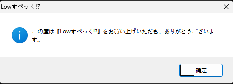

# Lowすぺっく 运行补丁制作记录
## 随便看看
### 运行


经典的AlphaRom  
教程也有不少，这边使用的是[这个方案](https://github.com/ZQF-ReVN/AlphaRom_Crack)
因为是SiglusEngine，那么后面一般还会有一个区域检测和dvd验证

那么整理一下思路，大概就是AlphaRom->过区域检测->过dvd检测->运行

## 1.过AlphaRom
### 在VirtualAlloc下个硬件断点

### 运行时仔细观察，EAX和堆栈
EAX为00001000时，我们堆栈里面已经出现了&"sarcheck.dll"  
  
这个就是alpharom的dll，我们可以在内存窗口打开  
  
第一个是对应的字符串  
第二是后面加载进来的sarcheck.dll地址  
第三个是dll的大小  
当EAX=10001000时直接进入对应地址，可以看到这个dll已经被直接拷贝到内存了，我们可以直接把它dump了  

   
然后多开一个x32dbg即可来到它的入口点  

   
复制器特征码，在内存布局窗口里面找一下特征码，然后来到对应位置，修改其入口，让他直接ret回去

   
### 把VirtualAlloc硬件断点取消，运行看看
  
不出意外，appharom已经过掉了，然后就是过区域检测和dvd检测了 

## 2.过区域检测
我这边选择在NtUserPeekMessage来个断点(断了几个常见的没有断到，我就直接断这个了)  

  
根据堆栈往上一个个断逐渐就能回到用户代码了，也能找到我补丁的第二hook点了，后面发现其实可以直接字符串搜索就有，也是白忙活  
  
简单分析了一下，我们直接在我的hook点2下面的条件跳转，来个强制大跳到下面即可
```asm
00602025 | B0 01              | mov al,1                                                           |
```
对应修改位置(已修改)  
```asm
00601DEF | E9 31020000        | jmp siglusengine.602025                                            |
00601DF4 | 90                 | nop                                                                |
```
### 运行看看
  
区域检测已经过了  
## 3.过dvd检测
没错我又不自觉的断了NtUserPeekMessage，然后通过堆栈往上找了  
然后很好的卡住了  
过来一晚上，试着断个NtUserShowWindow，然后时机选择在下面窗口弹出，另一个还没有弹出时  
  
堆栈：  
```
001AE170  005F611C  返回到 siglusengine.005F611C 自 ???
001AE174  006B0CB0  siglusengine.006B0CB0
001AE178  00000000  
```

<details>
<summary>dvd检测函数</summary>

```asm
005F5F90 | 55                 | push ebp                                                           |
005F5F91 | 8BEC               | mov ebp,esp                                                        |
005F5F93 | 6A FF              | push FFFFFFFF                                                      |
005F5F95 | 68 233E9900        | push siglusengine.993E23                                           |
005F5F9A | 64:A1 00000000     | mov eax,dword ptr fs:[0]                                           |
005F5FA0 | 50                 | push eax                                                           |
005F5FA1 | 81EC F8000000      | sub esp,F8                                                         |
005F5FA7 | A1 8014AB00        | mov eax,dword ptr ds:[AB1480]                                      | 00AB1480:"ｾﾍ>ｻA2ﾁD/"
005F5FAC | 33C5               | xor eax,ebp                                                        |
005F5FAE | 8945 EC            | mov dword ptr ss:[ebp-14],eax                                      |
005F5FB1 | 53                 | push ebx                                                           |
005F5FB2 | 56                 | push esi                                                           |
005F5FB3 | 57                 | push edi                                                           | edi:JMP.&NtUserShowWindow
005F5FB4 | 50                 | push eax                                                           |
005F5FB5 | 8D45 F4            | lea eax,dword ptr ss:[ebp-C]                                       |
005F5FB8 | 64:A3 00000000     | mov dword ptr fs:[0],eax                                           |
005F5FBE | 8BDA               | mov ebx,edx                                                        |
005F5FC0 | 899D 08FFFFFF      | mov dword ptr ss:[ebp-F8],ebx                                      |
005F5FC6 | 898D 00FFFFFF      | mov dword ptr ss:[ebp-100],ecx                                     | [ebp-100]:L"lowspec"
005F5FCC | 8B45 08            | mov eax,dword ptr ss:[ebp+8]                                       | [ebp+08]:L"riinyan"
005F5FCF | 8985 FCFEFFFF      | mov dword ptr ss:[ebp-104],eax                                     | [ebp-104]:L"riinyan"
005F5FD5 | E8 F61F0900        | call siglusengine.687FD0                                           |
005F5FDA | 8B35 0C6FAF00      | mov esi,dword ptr ds:[AF6F0C]                                      |
005F5FE0 | 8985 04FFFFFF      | mov dword ptr ss:[ebp-FC],eax                                      |
005F5FE6 | 3986 800B0000      | cmp dword ptr ds:[esi+B80],eax                                     |
005F5FEC | 75 07              | jne siglusengine.5F5FF5                                            |
005F5FEE | B0 01              | mov al,1                                                           |
005F5FF0 | E9 A8030000        | jmp siglusengine.5F639D                                            |
005F5FF5 | 8D8D 0CFFFFFF      | lea ecx,dword ptr ss:[ebp-F4]                                      |
005F5FFB | E8 40E40900        | call siglusengine.694440                                           |
005F6000 | 0F57C0             | xorps xmm0,xmm0                                                    |
005F6003 | C785 0CFFFFFF 0891 | mov dword ptr ss:[ebp-F4],siglusengine.A69108                      |
005F600D | 8D4D 8C            | lea ecx,dword ptr ss:[ebp-74]                                      |
005F6010 | C645 84 00         | mov byte ptr ss:[ebp-7C],0                                         |
005F6014 | F3:0F7F45 88       | movdqu xmmword ptr ss:[ebp-78],xmm0                                |
005F6019 | E8 325F0A00        | call siglusengine.69BF50                                           |
005F601E | 68 946CA500        | push siglusengine.A56C94                                           | A56C94:L"dummy"
005F6023 | 8D4D D4            | lea ecx,dword ptr ss:[ebp-2C]                                      | [ebp-2C]:L"『Lowすぺっく!?!』のディスクを入れてください。\n\n※プロテクトの誤認識ではありません。"
005F6026 | C745 FC 00000000   | mov dword ptr ss:[ebp-4],0                                         |
005F602D | E8 4E68F1FF        | call siglusengine.50C880                                           |
005F6032 | 51                 | push ecx                                                           |
005F6033 | C645 FC 01         | mov byte ptr ss:[ebp-4],1                                          |
005F6037 | 8D45 D4            | lea eax,dword ptr ss:[ebp-2C]                                      | [ebp-2C]:L"『Lowすぺっく!?!』のディスクを入れてください。\n\n※プロテクトの誤認識ではありません。"
005F603A | FF35 EC8DE004      | push dword ptr ds:[4E08DEC]                                        |
005F6040 | 8D8D 0CFFFFFF      | lea ecx,dword ptr ss:[ebp-F4]                                      |
005F6046 | 6A 00              | push 0                                                             |
005F6048 | 6A 00              | push 0                                                             |
005F604A | 50                 | push eax                                                           |
005F604B | 68 91000000        | push 91                                                            |
005F6050 | E8 2B2A0A00        | call siglusengine.698A80                                           |
005F6055 | C645 FC 00         | mov byte ptr ss:[ebp-4],0                                          |
005F6059 | 837D E8 08         | cmp dword ptr ss:[ebp-18],8                                        |
005F605D | 72 0B              | jb siglusengine.5F606A                                             |
005F605F | FF75 D4            | push dword ptr ss:[ebp-2C]                                         | [ebp-2C]:L"『Lowすぺっく!?!』のディスクを入れてください。\n\n※プロテクトの誤認識ではありません。"
005F6062 | E8 A3471200        | call siglusengine.71A80A                                           |
005F6067 | 83C4 04            | add esp,4                                                          |
005F606A | 33C0               | xor eax,eax                                                        |
005F606C | C745 E8 07000000   | mov dword ptr ss:[ebp-18],7                                        |
005F6073 | 66:8945 D4         | mov word ptr ss:[ebp-2C],ax                                        |
005F6077 | 8D8D 0CFFFFFF      | lea ecx,dword ptr ss:[ebp-F4]                                      |
005F607D | A1 506FAF00        | mov eax,dword ptr ds:[AF6F50]                                      | 00AF6F50:"tP[\n P[\n"
005F6082 | 83C0 1C            | add eax,1C                                                         |
005F6085 | C745 E4 00000000   | mov dword ptr ss:[ebp-1C],0                                        |
005F608C | 50                 | push eax                                                           |
005F608D | E8 6E030A00        | call siglusengine.696400                                           |
005F6092 | 8B85 10FFFFFF      | mov eax,dword ptr ss:[ebp-F0]                                      |
005F6098 | 85C0               | test eax,eax                                                       |
005F609A | 74 0D              | je siglusengine.5F60A9                                             |
005F609C | 50                 | push eax                                                           |
005F609D | FF15 20E5A000      | call dword ptr ds:[A0E520]                                         |
005F60A3 | 8B85 10FFFFFF      | mov eax,dword ptr ss:[ebp-F0]                                      |
005F60A9 | 8B3D 6CE5A000      | mov edi,dword ptr ds:[<&JMP.&NtUserShowWindow>]                    | edi:JMP.&NtUserShowWindow
005F60AF | 8B35 00E4A000      | mov esi,dword ptr ds:[A0E400]                                      |
005F60B5 | 85C0               | test eax,eax                                                       |
005F60B7 | 74 16              | je siglusengine.5F60CF                                             |
005F60B9 | 6A F0              | push FFFFFFF0                                                      |
005F60BB | 50                 | push eax                                                           |
005F60BC | FFD6               | call esi                                                           |
005F60BE | A9 00000010        | test eax,10000000                                                  |
005F60C3 | 7F 0A              | jg siglusengine.5F60CF                                             |
005F60C5 | 6A 05              | push 5                                                             |
005F60C7 | FFB5 10FFFFFF      | push dword ptr ss:[ebp-F0]                                         |
005F60CD | FFD7               | call edi                                                           | edi:JMP.&NtUserShowWindow
005F60CF | B9 E88DE004        | mov ecx,siglusengine.4E08DE8                                       |
005F60D4 | E8 278F0900        | call siglusengine.68F000                                           |
005F60D9 | 68 E8030000        | push 3E8                                                           |
005F60DE | FF15 2CE2A000      | call dword ptr ds:[<&JMP.&Sleep>]                                  |
005F60E4 | FFB5 FCFEFFFF      | push dword ptr ss:[ebp-104]                                        | [ebp-104]:L"riinyan"
005F60EA | 8B8D 00FFFFFF      | mov ecx,dword ptr ss:[ebp-100]                                     | [ebp-100]:L"lowspec"
005F60F0 | 8BD3               | mov edx,ebx                                                        |
005F60F2 | E8 59FBFFFF        | call siglusengine.5F5C50                                           |
005F60F7 | 8B8D 10FFFFFF      | mov ecx,dword ptr ss:[ebp-F0]                                      |
005F60FD | 83C4 04            | add esp,4                                                          |
005F6100 | 8AD8               | mov bl,al                                                          |
005F6102 | 85C9               | test ecx,ecx                                                       |
005F6104 | 74 16              | je siglusengine.5F611C                                             |
005F6106 | 6A F0              | push FFFFFFF0                                                      |
005F6108 | 51                 | push ecx                                                           |
005F6109 | FFD6               | call esi                                                           |
005F610B | A9 00000010        | test eax,10000000                                                  |
005F6110 | 7E 0A              | jle siglusengine.5F611C                                            |
005F6112 | 6A 00              | push 0                                                             |
005F6114 | FFB5 10FFFFFF      | push dword ptr ss:[ebp-F0]                                         |
005F611A | FFD7               | call edi                                                           | edi:JMP.&NtUserShowWindow
005F611C | 84DB               | test bl,bl                                                         |
005F611E | 0F85 68010000      | jne siglusengine.5F628C                                            |
005F6124 | 6A 01              | push 1                                                             |
005F6126 | 33C0               | xor eax,eax                                                        |
005F6128 | C745 D0 07000000   | mov dword ptr ss:[ebp-30],7                                        |
005F612F | 68 30F9A300        | push siglusengine.A3F930                                           |
005F6134 | 8D4D BC            | lea ecx,dword ptr ss:[ebp-44]                                      |
005F6137 | C745 CC 00000000   | mov dword ptr ss:[ebp-34],0                                        |
005F613E | 66:8945 BC         | mov word ptr ss:[ebp-44],ax                                        |
005F6142 | E8 3966F1FF        | call siglusengine.50C780                                           |
005F6147 | C645 FC 02         | mov byte ptr ss:[ebp-4],2                                          |
005F614B | 8D4D A4            | lea ecx,dword ptr ss:[ebp-5C]                                      |
005F614E | 6A 02              | push 2                                                             |
005F6150 | 33C0               | xor eax,eax                                                        |
005F6152 | C745 B8 07000000   | mov dword ptr ss:[ebp-48],7                                        |
005F6159 | 68 E8A9A500        | push siglusengine.A5A9E8                                           | A5A9E8:L"\\n"
005F615E | C745 B4 00000000   | mov dword ptr ss:[ebp-4C],0                                        |
005F6165 | 66:8945 A4         | mov word ptr ss:[ebp-5C],ax                                        |
005F6169 | E8 1266F1FF        | call siglusengine.50C780                                           |
005F616E | C645 FC 03         | mov byte ptr ss:[ebp-4],3                                          |
005F6172 | 8D45 BC            | lea eax,dword ptr ss:[ebp-44]                                      |
005F6175 | 8B15 506FAF00      | mov edx,dword ptr ds:[AF6F50]                                      | 00AF6F50:"tP[\n P[\n"
005F617B | 8D4D D4            | lea ecx,dword ptr ss:[ebp-2C]                                      | [ebp-2C]:L"『Lowすぺっく!?!』のディスクを入れてください。\n\n※プロテクトの誤認識ではありません。"
005F617E | 50                 | push eax                                                           |
005F617F | 8D45 A4            | lea eax,dword ptr ss:[ebp-5C]                                      |
005F6182 | 50                 | push eax                                                           |
005F6183 | 8D92 48010000      | lea edx,dword ptr ds:[edx+148]                                     |
005F6189 | E8 42DC0800        | call siglusengine.683DD0                                           |
005F618E | 83C4 08            | add esp,8                                                          |
005F6191 | 837D B8 08         | cmp dword ptr ss:[ebp-48],8                                        |
005F6195 | 72 0B              | jb siglusengine.5F61A2                                             |
005F6197 | FF75 A4            | push dword ptr ss:[ebp-5C]                                         |
005F619A | E8 6B461200        | call siglusengine.71A80A                                           |
005F619F | 83C4 04            | add esp,4                                                          |
005F61A2 | 33C0               | xor eax,eax                                                        |
005F61A4 | C745 B8 07000000   | mov dword ptr ss:[ebp-48],7                                        |
005F61AB | C745 B4 00000000   | mov dword ptr ss:[ebp-4C],0                                        |
005F61B2 | 66:8945 A4         | mov word ptr ss:[ebp-5C],ax                                        |
005F61B6 | C645 FC 06         | mov byte ptr ss:[ebp-4],6                                          |
005F61BA | 837D D0 08         | cmp dword ptr ss:[ebp-30],8                                        |
005F61BE | 72 0B              | jb siglusengine.5F61CB                                             |
005F61C0 | FF75 BC            | push dword ptr ss:[ebp-44]                                         |
005F61C3 | E8 42461200        | call siglusengine.71A80A                                           |
005F61C8 | 83C4 04            | add esp,4                                                          |
005F61CB | 33C0               | xor eax,eax                                                        |
005F61CD | C745 D0 07000000   | mov dword ptr ss:[ebp-30],7                                        |
005F61D4 | C745 CC 00000000   | mov dword ptr ss:[ebp-34],0                                        |
005F61DB | 66:8945 BC         | mov word ptr ss:[ebp-44],ax                                        |
005F61DF | E8 2CE8FEFF        | call siglusengine.5E4A10                                           |
005F61E4 | 6A 00              | push 0                                                             |
005F61E6 | E8 053F0600        | call siglusengine.65A0F0                                           |
005F61EB | 8B0D 506FAF00      | mov ecx,dword ptr ds:[AF6F50]                                      | 00AF6F50:"tP[\n P[\n"
005F61F1 | 83C1 1C            | add ecx,1C                                                         |
005F61F4 | 8379 14 08         | cmp dword ptr ds:[ecx+14],8                                        |
005F61F8 | 72 02              | jb siglusengine.5F61FC                                             |
005F61FA | 8B09               | mov ecx,dword ptr ds:[ecx]                                         |
005F61FC | 837D E8 08         | cmp dword ptr ss:[ebp-18],8                                        |
005F6200 | 8D45 D4            | lea eax,dword ptr ss:[ebp-2C]                                      | [ebp-2C]:L"『Lowすぺっく!?!』のディスクを入れてください。\n\n※プロテクトの誤認識ではありません。"
005F6203 | 6A 41              | push 41                                                            |
005F6205 | 0F4345 D4          | cmovae eax,dword ptr ss:[ebp-2C]                                   | [ebp-2C]:L"『Lowすぺっく!?!』のディスクを入れてください。\n\n※プロテクトの誤認識ではありません。"
005F6209 | 51                 | push ecx                                                           |
005F620A | 50                 | push eax                                                           |
005F620B | FF35 EC8DE004      | push dword ptr ds:[4E08DEC]                                        |
005F6211 | FF15 C8E4A000      | call dword ptr ds:[A0E4C8]                                         |
005F6217 | 6A 01              | push 1                                                             |
005F6219 | 8BF0               | mov esi,eax                                                        |
005F621B | E8 D03E0600        | call siglusengine.65A0F0                                           |
005F6220 | 83FE 02            | cmp esi,2                                                          |
005F6223 | 74 37              | je siglusengine.5F625C                                             |
005F6225 | C645 FC 00         | mov byte ptr ss:[ebp-4],0                                          |
005F6229 | 837D E8 08         | cmp dword ptr ss:[ebp-18],8                                        |
005F622D | 73 11              | jae siglusengine.5F6240                                            |
005F622F | 8B85 10FFFFFF      | mov eax,dword ptr ss:[ebp-F0]                                      |
005F6235 | 8B9D 08FFFFFF      | mov ebx,dword ptr ss:[ebp-F8]                                      |
005F623B | E9 6FFEFFFF        | jmp siglusengine.5F60AF                                            |
005F6240 | FF75 D4            | push dword ptr ss:[ebp-2C]                                         | [ebp-2C]:L"『Lowすぺっく!?!』のディスクを入れてください。\n\n※プロテクトの誤認識ではありません。"
005F6243 | E8 C2451200        | call siglusengine.71A80A                                           |
005F6248 | 8B85 10FFFFFF      | mov eax,dword ptr ss:[ebp-F0]                                      |
005F624E | 83C4 04            | add esp,4                                                          |
005F6251 | 8B9D 08FFFFFF      | mov ebx,dword ptr ss:[ebp-F8]                                      |
005F6257 | E9 53FEFFFF        | jmp siglusengine.5F60AF                                            |
005F625C | A1 1C6FAF00        | mov eax,dword ptr ds:[AF6F1C]                                      |
005F6261 | 33C9               | xor ecx,ecx                                                        |
005F6263 | 66:C780 AB010000 0 | mov word ptr ds:[eax+1AB],101                                      |
005F626C | C680 AD010000 01   | mov byte ptr ds:[eax+1AD],1                                        |
005F6273 | E8 E8690500        | call siglusengine.64CC60                                           |
005F6278 | 32DB               | xor bl,bl                                                          |
005F627A | 837D E8 08         | cmp dword ptr ss:[ebp-18],8                                        |
005F627E | 0F82 C6000000      | jb siglusengine.5F634A                                             |
005F6284 | FF75 D4            | push dword ptr ss:[ebp-2C]                                         | [ebp-2C]:L"『Lowすぺっく!?!』のディスクを入れてください。\n\n※プロテクトの誤認識ではありません。"
005F6287 | E9 B6000000        | jmp siglusengine.5F6342                                            |
005F628C | A1 0C6FAF00        | mov eax,dword ptr ds:[AF6F0C]                                      |
005F6291 | 8B8D 04FFFFFF      | mov ecx,dword ptr ss:[ebp-FC]                                      |
005F6297 | 68 30F9A300        | push siglusengine.A3F930                                           |
005F629C | 8988 800B0000      | mov dword ptr ds:[eax+B80],ecx                                     |
005F62A2 | 8D4D BC            | lea ecx,dword ptr ss:[ebp-44]                                      |
005F62A5 | E8 D665F1FF        | call siglusengine.50C880                                           |
005F62AA | 68 E8A9A500        | push siglusengine.A5A9E8                                           | A5A9E8:L"\\n"
005F62AF | 8D4D D4            | lea ecx,dword ptr ss:[ebp-2C]                                      | [ebp-2C]:L"『Lowすぺっく!?!』のディスクを入れてください。\n\n※プロテクトの誤認識ではありません。"
005F62B2 | C645 FC 07         | mov byte ptr ss:[ebp-4],7                                          |
005F62B6 | E8 C565F1FF        | call siglusengine.50C880                                           |
005F62BB | C645 FC 08         | mov byte ptr ss:[ebp-4],8                                          |
005F62BF | 8D45 BC            | lea eax,dword ptr ss:[ebp-44]                                      |
005F62C2 | 8B15 506FAF00      | mov edx,dword ptr ds:[AF6F50]                                      | 00AF6F50:"tP[\n P[\n"
005F62C8 | 8D4D A4            | lea ecx,dword ptr ss:[ebp-5C]                                      |
005F62CB | 50                 | push eax                                                           |
005F62CC | 8D45 D4            | lea eax,dword ptr ss:[ebp-2C]                                      | [ebp-2C]:L"『Lowすぺっく!?!』のディスクを入れてください。\n\n※プロテクトの誤認識ではありません。"
005F62CF | 50                 | push eax                                                           |
005F62D0 | 8D92 60010000      | lea edx,dword ptr ds:[edx+160]                                     |
005F62D6 | E8 F5DA0800        | call siglusengine.683DD0                                           |
005F62DB | 83C4 08            | add esp,8                                                          |
005F62DE | 837D E8 08         | cmp dword ptr ss:[ebp-18],8                                        |
005F62E2 | 72 0B              | jb siglusengine.5F62EF                                             |
005F62E4 | FF75 D4            | push dword ptr ss:[ebp-2C]                                         | [ebp-2C]:L"『Lowすぺっく!?!』のディスクを入れてください。\n\n※プロテクトの誤認識ではありません。"
005F62E7 | E8 1E451200        | call siglusengine.71A80A                                           |
005F62EC | 83C4 04            | add esp,4                                                          |
005F62EF | 33C0               | xor eax,eax                                                        |
005F62F1 | C745 E8 07000000   | mov dword ptr ss:[ebp-18],7                                        |
005F62F8 | C745 E4 00000000   | mov dword ptr ss:[ebp-1C],0                                        |
005F62FF | 66:8945 D4         | mov word ptr ss:[ebp-2C],ax                                        |
005F6303 | C645 FC 0B         | mov byte ptr ss:[ebp-4],B                                          | 0B:'\v'
005F6307 | 837D D0 08         | cmp dword ptr ss:[ebp-30],8                                        |
005F630B | 72 0B              | jb siglusengine.5F6318                                             |
005F630D | FF75 BC            | push dword ptr ss:[ebp-44]                                         |
005F6310 | E8 F5441200        | call siglusengine.71A80A                                           |
005F6315 | 83C4 04            | add esp,4                                                          |
005F6318 | 33C0               | xor eax,eax                                                        |
005F631A | C745 D0 07000000   | mov dword ptr ss:[ebp-30],7                                        |
005F6321 | 8D4D A4            | lea ecx,dword ptr ss:[ebp-5C]                                      |
005F6324 | C745 CC 00000000   | mov dword ptr ss:[ebp-34],0                                        |
005F632B | 66:8945 BC         | mov word ptr ss:[ebp-44],ax                                        |
005F632F | 8D50 40            | lea edx,dword ptr ds:[eax+40]                                      |
005F6332 | E8 59E7FEFF        | call siglusengine.5E4A90                                           |
005F6337 | 837D B8 08         | cmp dword ptr ss:[ebp-48],8                                        |
005F633B | B3 01              | mov bl,1                                                           |
005F633D | 72 0B              | jb siglusengine.5F634A                                             |
005F633F | FF75 A4            | push dword ptr ss:[ebp-5C]                                         |
005F6342 | E8 C3441200        | call siglusengine.71A80A                                           |
005F6347 | 83C4 04            | add esp,4                                                          |
005F634A | 8B85 10FFFFFF      | mov eax,dword ptr ss:[ebp-F0]                                      |
005F6350 | 85C0               | test eax,eax                                                       |
005F6352 | 74 0D              | je siglusengine.5F6361                                             |
005F6354 | 6A 00              | push 0                                                             |
005F6356 | 6A 00              | push 0                                                             |
005F6358 | 6A 10              | push 10                                                            |
005F635A | 50                 | push eax                                                           |
005F635B | FF15 1CE4A000      | call dword ptr ds:[A0E41C]                                         |
005F6361 | 8B45 8C            | mov eax,dword ptr ss:[ebp-74]                                      |
005F6364 | C785 0CFFFFFF 0891 | mov dword ptr ss:[ebp-F4],siglusengine.A69108                      |
005F636E | 85C0               | test eax,eax                                                       |
005F6370 | 74 1E              | je siglusengine.5F6390                                             |
005F6372 | 50                 | push eax                                                           |
005F6373 | E8 92441200        | call siglusengine.71A80A                                           |
005F6378 | 83C4 04            | add esp,4                                                          |
005F637B | C745 8C 00000000   | mov dword ptr ss:[ebp-74],0                                        |
005F6382 | C745 90 00000000   | mov dword ptr ss:[ebp-70],0                                        |
005F6389 | C745 94 00000000   | mov dword ptr ss:[ebp-6C],0                                        |
005F6390 | 8D8D 0CFFFFFF      | lea ecx,dword ptr ss:[ebp-F4]                                      |
005F6396 | E8 05E10900        | call siglusengine.6944A0                                           |
005F639B | 8AC3               | mov al,bl                                                          |
005F639D | 8B4D F4            | mov ecx,dword ptr ss:[ebp-C]                                       |
005F63A0 | 64:890D 00000000   | mov dword ptr fs:[0],ecx                                           |
005F63A7 | 59                 | pop ecx                                                            |
005F63A8 | 5F                 | pop edi                                                            | edi:JMP.&NtUserShowWindow
005F63A9 | 5E                 | pop esi                                                            |
005F63AA | 5B                 | pop ebx                                                            |
005F63AB | 8B4D EC            | mov ecx,dword ptr ss:[ebp-14]                                      |
005F63AE | 33CD               | xor ecx,ebp                                                        |
005F63B0 | E8 46441200        | call siglusengine.71A7FB                                           |
005F63B5 | 8BE5               | mov esp,ebp                                                        |
005F63B7 | 5D                 | pop ebp                                                            |
005F63B8 | C3                 | ret                                                                |
```
</details>
这个结构在我后面搞ab，sprb时可以说是一样的 

罚抄hf有点不一样    

分析一下就完成了第三个hook的位置了   

我们其实直接从    

```
005F5FF0 | E9 A8030000        | jmp siglusengine.5F639D                                            |
```
直接大跳到 

```
005F639D | 8B4D F4            | mov ecx,dword ptr ss:[ebp-C]                                       |
```
这里即可，但是懒得改了 


补丁代码是从那个位置跳到005F639D上一个位置，并强制修改al的值，使其为1返回的 


## 运行看看


## 很好开始写补丁

[补丁源码](https://github.com/jkgwj/jkgbk-note/tree/master/src/galgame/Low%E3%81%99%E3%81%BA%E3%81%A3%E3%81%8F%EF%BC%81%EF%BC%9F/cpp-dll/version)


